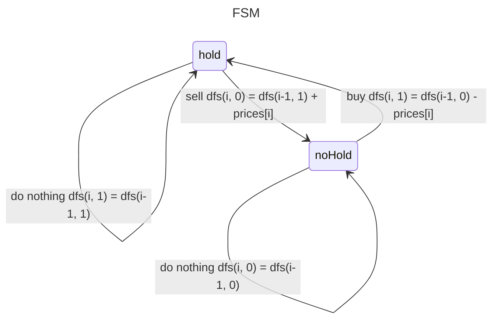

# Preliminary 198. House Robber

[题目网址](https://leetcode.cn/problems/house-robber). 动态规划的核心是状态定义和状态转移方程，对于子集型回溯有选/不选以及选哪个这两种思路，对于 DP 也是一样的。对于本题从第一个或者最后一个房子进行思考是最容易的。如果选，那么剩下 n-2 个房子；如果不选，那么剩下 n-1 个房子。

这里从最后一个房子开始，因此我们的回溯三问就是
- 当前操作: 枚举**第** i 个房子选不选。
- 子问题: 从**前** i 个房子中得到的最大金额和。
- 下一个子问题: 分类讨论:
    - 选: 从**前** i-1 个房子中得到的最大金额和。
    - 不选: 从**前** i-2 个房子中得到的最大金额和。

我们的回溯模板可以写作 dfs(i) = max(dfs(i-1), dfs(i-2) + nums[i]).

在定义 DFS 或者 DP 数组的含义时，只能表示从一些元素中算出的结果，而不是一个结果中算出的结果。注意这里没有把得到的金额作为递归的输入参数，而是作为返回值。 

```cpp
class Solution {
public:
    int dfs(int i, vector<int>& nums) {
        if (i < 0)
            return 0;
        return max(dfs(i-1, nums), dfs(i-2, nums) + nums[i]);
    }
    
    int rob(vector<int>& nums) {
        int n = nums.size();
        return dfs(n - 1, nums);
    }
};
```

由于回溯的时间复杂度是指数级别的，上述算法会超时。仔细观察搜索树会发现，第一次选了后会进行 dfs(2)，第一次不选第二次也不选又会进行 dfs(2)，导致了重复计算。优化方法是第一次计算的时候可以通过一个数组来记录结果，将递归计算的结果保留下来，那么下次递归到同样入参的时候，就直接返回先前保存的结果。这样树中只有 n 个节点，时间复杂度得到优化。

```cpp
class Solution {
public:
    int dfs(int i, vector<int>& nums, vector<int>& cache) {
        if (i < 0)
            return 0;
        if (cache[i] != -1)  // find in cache
            return cache[i];
        int res = max(dfs(i-1, nums, cache), dfs(i-2, nums, cache) + nums[i]);
        cache[i] = res;  // reserve result
        return res;
    }
    
    int rob(vector<int>& nums) {
        int n = nums.size();
        vector<int> cache(n, -1);
        return dfs(n - 1, nums, cache);
    }
};
```

关于时间复杂度的计算有一个公式: **状态个数 x 单次状态计算时间**。这里状态个数是 $O(n)$，单词状态计算时间是 $O(1)$，因此时间复杂度为 $O(n)$. 使用了一个 cache 数组，空间复杂度为 $O(n)$.

观察可发现这里的 max 计算发生在 dfs 调用结束之后，也就是递归中归的过程。再次观察搜索树会发现 dfs(0) 和 dfs(1) 归到 dfs(2)，dfs(1) 和 dfs(2) 归到 dfs(3). 既然知道哪些点会归到哪个点，干脆直接去掉递归中的递，只保留归的过程，也就是直接从最下面向上计算，这就是递推。具体来说就是将 dfs 改成数组，递归改成循环的形式，但这样需要对递归边界也就是 i=0 和 i=1 特殊处理，否则会出现负数下标。

$$
\begin{aligned}
dfs(i)&=\max\left(dfs(i-1),dfs(i-2)+nums[i]\right)\\
f[i]&=\max\left(f[i-1],f[i-2]+nums[i]\right)\\
f[i+2]&=\max\left(f[i+1],f[i]+nums[i]\right)\end{aligned}
$$

```cpp
class Solution {
public:
    int rob(vector<int>& nums) {
        int n = nums.size();
        vector<int> f(n + 2, 0);
        for (int i = 0; i < nums.size(); i++) {
            f[i + 2] = max(f[i + 1], f[i] + nums[i]);
        }
        return f[n + 1];
    }
};
```

上述做法的空间复杂度仍为 $O(n)$，再观察递推公式可发现当前状态的值只依赖于上一个状态和上上个状态，因此我们可以只保留两个状态值，在地推过程中不断更新。最后返回 f1，因为它是最后一次算出的 newF.

$$
\begin{aligned}&\text{当前}=\max (\text{上一个,上上一个}+nums[i])\\&f_0\text{ 表示上上一个,}f_1\text{ 表示上一个}\\&newF=\max\left(f_1,f_0+nums[i]\right)\\&f_0=f_1\\&f_1=newF\end{aligned}
$$

```cpp
class Solution {
public:
    int rob(vector<int>& nums) {
        int n = nums.size();
        int f0 = 0, f1 = 0;
        for (int i = 0; i < nums.size(); i++) {
            int newF = max(f1, f0 + nums[i]);
            f0 = f1;
            f1 = newF;
        }
        return f1;
    }
};
```

## 70. Climbing Stairs

[题目网址](https://leetcode.cn/problems/climbing-stairs). 爬 n 阶楼梯的方法数量，等于 2 部分之和：
1. 先爬一步，加上后面的 n-1 阶楼梯爬法。
2. 先爬两步，加上后面的 n-2 阶楼梯爬法。

因此递推公式有 `f(n) = f(n-1) + f(n-2)`. 初始化 `f0=0` 可以理解为开始不用爬就 1 种方法。

```cpp
class Solution {
public:
    int climbStairs(int n) {
        // 爬到 n-1 阶的方式 + 爬到 n-2 阶的方式
        // f(n) = f(n-1) + f(n-2)
        int f0 = 0, f1 = 1;
        for (int i = 1; i <= n; i++) {
            int newF = f0 + f1;
            f0 = f1;
            f1 = newF;
        }
        return f1;
    }
};
```

## 746. Min Cost Climbing Stairs

[题目网址](https://leetcode.cn/problems/min-cost-climbing-stairs). 爬 n 阶楼梯的最小花费，等于下面 2 种情况的较小者：
1. 爬到 n-1 阶的最小花费 + cost[n-1].
2. 爬到 n-2 阶的最小花费 + cost[n-2].

因此递推公式有 `f(n) = min(f(n-1) + cost[n-1], f(n-2) + cost[n-2])`. 因为可以从第 0 阶或者 第 1 阶开始爬，因此 初始化 `f0=f1=0`.

```cpp
class Solution {
public:
    int minCostClimbingStairs(vector<int>& cost) {
        // f(n) = min(f(n-1) + cost[n-1], f(n-2) + cost[n-2])
        int f0 = 0, f1 = 0;
        for (int i = 2; i <= cost.size(); i++) {  // nums[n-1] needs climb
            int newF = min(f1 + cost[i-1], f0 + cost[i-2]);
            f0 = f1;
            f1 = newF;
        }
        return f1;
    }
};
```

## 213. House Robber II

[题目网址](https://leetcode.cn/problems/house-robber-ii). 思路跟 198 一样，只不过这里是围成一圈，分成偷第一家和偷最后一家进行递推。

```cpp
class Solution {
public:
    int rob(vector<int>& nums) {
        if (nums.size() == 1) return nums[0];
        int n = nums.size();
        int f0 = 0, f1 = 0;
        int robFirst = 0, robLast = 0;
        for (int i = 0; i < n - 1; i ++) {
            robFirst = max(f0 + nums[i], f1);
            f0 = f1;
            f1 = robFirst;
        }
        f0 = 0;
        f1 = 0;
        for (int i = 1; i < n; i ++) {
            robLast = max(f0 + nums[i], f1);
            f0 = f1;
            f1 = robLast;
        }
        return max(robFirst, robLast);
    }
};
```

## 740. Delete and Earn

[题目网址](https://leetcode.cn/problems/delete-and-earn). 数组中的每个数字 num 都会贡献一定的点数，但选择 num 后，会导致 num-1 和 num+1 的数字无法选择。这种限制类似于“打家劫舍”问题中不能选择相邻的房子。需要将问题转化为选择一组不相邻的数字 (在值域上不相邻)，并最大化点数和。

- 首先统计每个数字出现的频率。例如，对于 nums = [3,4,2]，可以计算出 2 出现 1 次，3 出现 1 次，4 出现 1 次。

- 将每个数字 i 的点数定义为 i * freq[i]，其中 freq[i] 是数字 i 出现的次数。这样，问题转化为选择一组值域上不相邻的数字，使得总点数最大。

- 假设数组中的最大值为 maxVal，我们需要考虑从 0 到 maxVal 的所有数字 (即使某些数字的频率为 0)。

定义状态 f[i] 表示在值域 [0, i] 上选择数字所能获得的最大点数，且最后一个选择的数字可以是 i 或不选 i. 对于每个数字 i，有两种选择：
- 不选: 最大点数为 dp[i-1] (前 i-1 个数字的最大点数)。
- 选: 获得 i * freq[i] 的点数，但不能选 i-1，因此最大点数为 dp[i-2] + i * freq[i].

因此有 `f[i] = max(f[i-1], f[i-2] + i * f[i])`

```cpp
class Solution {
public:
    int deleteAndEarn(vector<int>& nums) {
        int n = nums.size();
        int maxVal = ranges::max(nums);
        vector<int> freq(maxVal + 1, 0);

        for(int num: nums)
            freq[num]++;
        
        int f0 = 0, f1 = 1 * freq[1];
        for(int i = 2; i <= maxVal; i++) {
            int newF = max(f0 + i * freq[i], f1);
            f0 = f1;
            f1 = newF;
        }
        return f1;
    }
};
```

## 2466. Count Ways to Build Good Strings

[题目网址](https://leetcode.cn/problems/count-ways-to-build-good-strings). 相当于一次可以爬 zero 个台阶或者一次可以爬 one 个台阶，统计爬 [low, high] 内的台阶一共有几种方法。注意更新的时候避免数组下标未负数。

```cpp
class Solution {
public:
    int countGoodStrings(int low, int high, int zero, int one) {
        // f[high - one] + f[high - zero]
        const int MOD = 1000000007;
        vector<int> f(high + 1, 0);
        f[0] = 1;

        int minLen = zero < one ? zero : one;
        for (int i = minLen; i <= high; i++) {
            if (i >= zero) {
                f[i] = (f[i] + f[i - zero]) % MOD;
            }
            if (i >= one) {
                f[i] = (f[i] + f[i - one]) % MOD;
            }
        }
        int ans = 0;
        for (int i = low; i <= high; i++)
            ans = (ans + f[i]) % MOD;
        return ans;
    }
};
```

# 0/1 knapsack Problem

0-1 背包:有 n 个物品,第 i 个物品的体积为 w[i],价值为 v[i]. 每个物品至多选一个,求体积和不超过 capacity 时的最大价值和。

- 当前操作: 枚举第 i 个物品选或不选。选，剩余容量减少 w[i]；不选，剩余容量不变。
- 子问题: 剩余容量为 c 时，从前 i 个物品中得到的最大价值和。
- 下一个子问题: 分类讨论
    - 不选: 剩余容量为 c 时，从前 i-1 个物品中得到的最大价值和。
    - 选: 剩余容量为 c - w[i] 时，从前 i-1 个物品中得到的最大价值和。

因此递归模型为 $dfs(i,c)=\max\left(dfs(i-1,c),dfs(i-1,c-w[i])+v[i]\right)$. 

```cpp
int dfs(int i, int capacity,  vector<int>& weights, vector<int>& values) {
    if (i < 0)
        return 0;
    if (weights[i] > capacity)
        return dfs(i - 1, capacity);
    return max(dfs(i - 1, capacity), 
                dfs(i - 1, capacity - weights[i]) + values[i]);
}

int zeroOneKnapsack(int capacity, vector<int>& weights, vector<int>& values) {
    int n = weights.size();
    return dfs(n - 1, capacity, weights, values);
}
```

和上一节一样，我们可以用一个数组来记录递归过程中每个子问题的解。由于这里递归需要两个参数，初始化一个二维数组 `memo[n][capacity + 1]` 表示在剩余容量 capacity 下选择 i 个物品的最大价值。

```cpp
int dfs(int i, int capacity, vector<int>& weights, vector<int>& values, vector<vector<int>>& memo) {
    if (i < 0)
        return 0;
    if (memo[i][capacity] != -1) 
        return memo[i][capacity];
    if (weights[i] > capacity) 
        return memo[i][capacity] = dfs(i - 1, capacity, weights, values, memo);
    return memo[i][capacity] = max(dfs(i - 1, capacity, weights, values, memo),
                                   dfs(i - 1, capacity - weights[i], weights, values, memo) + values[i]);
}
```

## 494. Target Sum

[题目网址](https://leetcode.cn/problems/target-sum). 假设数组总和为 s，正数和为 p，负数和的绝对值为 n，则：
- p - n = target
- p + n = s

推导得 p = (target + s) / 2. 因此，问题等价于在 nums 中选择一些数，使其和恰好为 (target + s) / 2. 这种选或不选问题正好可以用 01 背包的思路解决。


由于 p 是正整数 所以如果 (target + s) / 2 < 0 或者 target + s 是奇数那么肯定找不到方案。根据互斥原理，总的方案数可以分成选第 i 个数和不选两种情况的方案数目之和。

```cpp
class Solution {
    int dfs(int i, vector<int>& nums, int target) {  // choose nums[i] as pos or not
        if (i < 0)
            return target == 0 ? 1 : 0;
        if (nums[i] > target)
            return dfs(i - 1, nums, target);
        return dfs(i - 1, nums, target) + dfs(i - 1, nums, target - nums[i]);
    }
public:
    int findTargetSumWays(vector<int>& nums, int target) {
        // p: sum of positive nums
        // n: abs of sum of negative nums
        // then we have p - n = t p + n = sum(nums)
        // p = (t + sum(nums)) / 2
        int n = nums.size();
        int s = accumulate(nums.begin(), nums.end(), 0);
        target += s;
        if (target < 0 || target % 2 == 1)
            return 0;
        target /= 2;
        vector<vector<int>> f(n, vector<int>(target + 1, 0));
        return dfs(n- 1, nums, target);
    }
};
```

记 c = (target + s) / 2，用上记忆化搜索并且避免索引为负数我们有. f 数组表示前 i 个数中进行选择使和为 c 的方案数目。

$$
\begin{aligned}
dfs(i,c)&=dfs(i-1,c)+dfs(i-1,c-nums[i])\\
f[i][c]&=f[i-1][c]+f[i-1][c-nums[i]]\\
f[i+1][c]&=f[i][c]+f[i][c-nums[i]]
\end{aligned}
$$

```cpp
int findTargetSumWays(vector<int>& nums, int target) {
    int n = nums.size();
    int s = accumulate(nums.begin(), nums.end(), 0);
    target += s;
    if (target < 0 || target % 2 == 1)
        return 0;
    target /= 2;
    vector<vector<int>> f(n + 1, vector<int>(target + 1, 0));
    f[0][0] = 1;
    for (int i = 0; i < n; i++) {
        for (int c = 0; c <= target; c++) {
            if (nums[i] > c) {
                f[i + 1][c] = f[i][c];
            } else {
                f[i + 1][c] = f[i][c] + f[i][c-nums[i]];
            }
        }
    }
    return f[n][target];
}
```

从递推公式可以看出每次计算完 f[i+1] 后就不需要用到 f[i] 了。也就是说每时每刻只有两个数组的元素在参与状态转移，因此可以用两个数组来存储状态。$f[(i+1)\%2][c]=f[i\%2][c]+f[i\%2][c-nums[i]]$

```cpp
int findTargetSumWays(vector<int>& nums, int target) {
    int n = nums.size();
    int s = accumulate(nums.begin(), nums.end(), 0);
    target += s;
    if (target < 0 || target % 2 == 1)
        return 0;
    target /= 2;
    vector<vector<int>> f(2, vector<int>(target + 1, 0));
    f[0][0] = 1;
    for (int i = 0; i < n; i++) {
        for (int c = 0; c <= target; c++) {
            if (nums[i] > c) {
                f[(i + 1)%2][c] = f[i%2][c];
            } else {
                f[(i + 1)%2][c] = f[i%2][c] + f[i%2][c-nums[i]];
            }
        }
    }
    return f[n%2][target];
}
```

更进一步，可以只用一个数组来存储状态。但由于后面的状态值依赖于前面的，因此我们要从后往前更新状态，避免覆盖。由于 nums[i] > c 的时候数组的状态是不变的，因此只用更新从 target 到 nums[i] 的情况。

```cpp
int findTargetSumWays(vector<int>& nums, int target) {
    int n = nums.size();
    int s = accumulate(nums.begin(), nums.end(), 0);
    target += s;
    if (target < 0 || target % 2 == 1)
        return 0;
    target /= 2;
    vector<int> f(target + 1, 0);
    f[0] = 1;
    for (int i = 0; i < n; i++)
        for (int c = target; c >= nums[i]; c--) {
                f[c] = f[c] + f[c-nums[i]];
        }
    
    return f[target];
}
```
## 2915. Length of the Longest Subsequence that Sums to Target

[题目网址](https://leetcode.cn/problems/length-of-the-longest-subsequence-that-sums-to-target). f 表示从前 i 个数中进行选择使得和为 c 的子数组中最长的长度。递归的边界条件为 i = 0 时 若 target = 0 表示能找到，返回 0 (空数组长度)；否则返回 INT_MIN 表示找不到。

```cpp
class Solution {
public:
    int lengthOfLongestSubsequence(vector<int>& nums, int target) {
        // f[i][c] = max(f[i-1][c] , f[i-1][c - nums[i]] + 1)
        // f is max sub seq len in first i nums which sum is c
        int n = nums.size();
        vector<vector<int>> f(n + 1, vector<int>(target + 1, INT_MIN));
        f[0][0] = 0;

        for (int i = 0; i < n; i++) {
            for (int c = 0; c <= target; c++) {
                if (nums[i] > c) {
                    f[i+1][c] = f[i][c];
                } else {
                    f[i+1][c] = max(f[i][c] , f[i][c - nums[i]] + 1);
                }
            }
        }
        return f[n][target] > 0 ? f[n][target] : -1;
    }
};
```

仿照 0/1 背包可以进行空间优化。

```cpp
int lengthOfLongestSubsequence(vector<int>& nums, int target) {
    int n = nums.size();
    vector<int> f(target + 1, INT_MIN);
    f[0] = 0;

    for (int i = 0; i < n; i++) {
        for (int c = target; c >= nums[i]; c--) {
            f[c] = max(f[c] , f[c - nums[i]] + 1);
        }
    }
    return f[target] > 0 ? f[target] : -1;
}
```

## 416. Partition Equal Subset Sum

[题目网址](https://leetcode.cn/problems/partition-equal-subset-sum). 相当于判断能否选择元素使得和等于整个数组之和的一半。f 表示能否从前 i 个数中进行选择使得和为 c.

```cpp
class Solution {
public:
    bool canPartition(vector<int>& nums) {
        int n = nums.size();
        int s = accumulate(nums.begin(), nums.end(), 0);
        if (s % 2) return false;
        int target = s / 2;
        // f[i][c] = f[i-1][c] || f[i-1][c-nums[i]]
        // f is can select in first i ele which sum is c
        vector<vector<bool>> f(n + 1, vector<bool>(target + 1, false));
        f[0][0] = true;

        for (int i = 0; i < n; i++) {
            for (int c = 0; c <= target; c++) {
                if (nums[i] > c) {
                    f[i+1][c] = f[i][c];
                } else {
                    f[i+1][c] = f[i][c] || f[i][c-nums[i]];
                }
            }
        }
        return f[n][target];
    }
};
```

## 2787. Ways to Express an Integer as Sum of Powers

[题目网址](https://leetcode.cn/problems/ways-to-express-an-integer-as-sum-of-powers). 本题也是恰好装满型 0/1 背包的方案数。需要注意的是计算 pow 的时候由于修改了数组索引避免负数，应该为 `pow(i + 1, x)`.

```cpp
class Solution {
public:
    int numberOfWays(int n, int x) {
        int MOD = 1'000'000'007;
        int m = 0;
        while (pow(m + 1, x) <= n) {
            m++;
        }
        // f[i][c] = f[i-1][c] + f[i-1][c-i^x];
        vector<vector<int>> f(m + 2, vector<int>(n + 1, 0));
        f[0][0] = 1;
        
        for (int i = 0; i <= m; i++) {
            int val = pow(i + 1, x);  // nums[i] is i+1
            for (int c = 0; c <= n; c++) {
                if (val > c) {
                    f[i+1][c] = f[i][c];
                } else {
                    f[i+1][c] = f[i][c] + f[i][c-val];
                }
            }
        }
        return f[m+1][n] % MOD;
    }
};
```

一维空间优化后代码如下，一维数组求方案数是在一直累加的，所以循环内要取模。

```cpp
int numberOfWays(int n, int x) {
    int MOD = 1'000'000'007;
    int m = 0;
    while (pow(m + 1, x) <= n) {
        m++;
    }
    // f[i][c] = f[i-1][c] + f[i-1][c-i^x];
    vector<int> f(n + 1, 0);
    f[0] = 1;
    
    for (int i = 0; i <= m; i++) {
        int val = pow(i + 1, x);  // nums[i] is i+1
        for (int c = n; c >= val; c--) {  
            f[i+1][c] = (f[i][c] + f[i][c-val]) % MOD;
        }
    }
    return f[n] % MOD;
}
```

# Unbounded Knapsack Problem

完全背包:有 n **种**物品,第 i 种物品的体积为 w[i],价值为 v[i]. 每种物品可以选无限次,求体积和不超过 capacity 时的最大价值和。

- 当前操作: 枚举第 i 种物品选一个或不选。选，剩余容量减少 w[i]；不选，剩余容量不变。
- 子问题: 剩余容量为 c 时，从前 i 种物品中得到的最大价值和。
- 下一个子问题: 分类讨论
    - 不选: 剩余容量为 c 时，从前 i-1 种物品中得到的最大价值和。
    - 选: 剩余容量为 c - w[i] 时，从前 i 种物品中得到的最大价值和。

代码和之前唯一的区别就是选第 i 种物品的时候递归到的还是 i. 

## 322.

这其实是完全背包的一种变形，把硬币的价值看成 1，把最大改成求最小就可以得到 

$dfs(i,c)=\min\left(dfs(i-1,c),dfs(i-1,c-coins[i])+1\right)$.

```cpp
class Solution {
public:
    long long dfs(int i, vector<int>& coins, long long amount) {
        if (i < 0)
            return amount ? INT_MAX : 0;
        if (coins[i] > amount)
            return dfs(i - 1, coins, amount);
        return min(dfs(i - 1, coins, amount), 
                    dfs(i, coins, amount - coins[i]) + 1);
    }
    
    int coinChange(vector<int>& coins, int amount) {
        int n = coins.size();
        long long  res = dfs(n - 1, coins, (long long) amount);
        return res < INT_MAX ? res : -1;
    }
};
```

翻译成递推情况，从回溯可知，i = 0 (索引 +1 防止负数) 且 amount = 0 时返回 0，其他情况都是 INT_MAX / 2 (防止溢出). 

```cpp
int coinChange(vector<int>& coins, int amount) {
    int n = coins.size();
    vector<vector<int>> f(n + 1, vector<int>(amount + 1, INT_MAX / 2));
    f[0][0] = 0;

    for (int i = 0; i < n; i++) {
        for (int c = 0; c <= amount; c++) {
            if (coins[i] > c) {
                f[i + 1][c] = f[i][c];
            } else {
                f[i + 1][c] = min(f[i][c], f[i + 1][c - coins[i]] + 1);
            }
        }
    }
    return f[n][amount] < INT_MAX / 2 ? f[n][amount] : -1;
}
```

对于完全背包问题使用一维数组时，可以从前往后计算，因为当前更新的状态来于上一步同时的状态和这一步已经计算出来的状态。同时由于 coins[i] > c 时状态不变，我们可以从 c = coins[i] 时开始更新。

```cpp
int coinChange(vector<int>& coins, int amount) {
    int n = coins.size();
    vector<int> f(amount + 1, INT_MAX / 2);
    f[0] = 0;

    for (int i = 0; i < n; i++) {
        for (int c = coins[i]; c <= amount; c++) {
                f[c] = min(f[c], f[c - coins[i]] + 1);
        }
    }
    return f[amount] < INT_MAX / 2 ? f[amount] : -1;
}
```

常见变形
- 至多装 capacity，求方案数/最大价值和
- 恰好装 capacity，求方案数/最大/最小价值和
- 至少装 capacity，求方案数/最小价值和

494 对于至多的情况，dfs 在边界判定的时候就不需要判断 c 是否等于 0 了 (因为不要求装满)，同时初始化 f 数组都为 1 (至少有一种方案也就是不装).

对于至少的情况 dfs 在边界判定的时候条件判断变为 c <= 0 (因为可以超出). 使用递推更新状态的时候要循环到 c = 0 的情况 (因为每个物品都可以选或不选，有 2^n 种情况，因此这样循环每个物品都能考虑到两种情况)，同时改成 f[max(c-nums[i], 0)] 表示把 c <= 0 的状态都记录到 f[0] 里。

## 518. Coin Change II

[题目网址](https://leetcode.cn/problems/coin-change-ii). 完全背包问题，定义 dfs(i,c) 表示用前 i 种硬币组成金额 c 的方案数，考虑「选或不选」，有：
- 不再继续选第 i 种硬币: `dfs(i−1,c)`
- 继续选一枚第 i 种硬币: `dfs(i,c−coins[i])`

根据加法原理，二者相加得 `dfs(i,c) = dfs(i−1,c) + dfs(i,c−coins[i])`

- 递归边界: `dfs(−1,0) = 1`, `dfs(−1, >0) = 0` (遍历完所有硬币仍然找不到和为 c)
- 递归入口: `dfs(n−1,amount)`

```cpp
class Solution {
public:
    int change(int amount, vector<int>& coins) {
        // f[i][c] = f[i-1][c] + f[i][c-coins[i]]
        int n = coins.size();
        vector<vector<unsigned long long>> f(n + 1, vector<unsigned long long>(amount + 1, 0));
        f[0][0] = 1;

        for (int i = 0; i < n; i++) {
            for (int c = 0; c <= amount; c++) {
                if (coins[i] > c) {
                    f[i + 1][c] = f[i][c];
                } else {
                    f[i + 1][c] = f[i][c] + f[i + 1][c - coins[i]];
                }
            }
        }
        return f[n][amount];
    }
};
```

一维数组空间优化，完全背包问题正向更新状态。

```cpp
int change(int amount, vector<int>& coins) {
    // f[i][c] = f[i-1][c] + f[i][c-coins[i]]
    int n = coins.size();
    vector<unsigned long long> f(amount + 1, 0);
    f[0] = 1;

    for (int i = 0; i < n; i++) {
        for (int c = coins[i]; c <= amount; c++) {
            f[c] = f[c] + f[c - coins[i]];
        }
    }
    return f[amount];
}
```

## 279. Perfect Squares

[题目网址](https://leetcode.cn/problems/perfect-squares). 定义 dfs(i,c) 为从前 i 个完全平方数中选一些数 (可以重复选)，满足元素和恰好等于 c，最少要选的数字个数。

- 递归边界: `dfs(0,0) = 0`, `dfs(0,>0) = INF` (要取 min，初始化为最大)
- 递归入口: `dfs(sqrt(n),n)`

```cpp
class Solution {
public:
    int numSquares(int n) {
        // f[i][c] = min(f[i-1][c], f[i][c - i^2] + 1)
        int m = sqrt(n);
        vector<vector<int>> f(m + 2, vector<int>(n + 1, INT_MAX / 2));
        f[0][0] = 0;
        for (int i = 0; i <= m; i++) {
            int val = (i + 1) * (i + 1);
            for (int c = 0; c <= n; c++) {
                if (val > c) {
                    f[i + 1][c] = f[i][c];
                } else {
                    f[i + 1][c] = min(f[i][c], f[i + 1][c - val] + 1);
                }
            }
        }
        return f[m+1][n];
    }
};
```

一维数组空间优化

```cpp
int numSquares(int n) {
    // f[i][c] = min(f[i-1][c], f[i][c - i^2] + 1)
    int m = sqrt(n);
    vector<int> f(n + 1, INT_MAX / 2);
    f[0] = 0;
    for (int i = 0; i <= m; i++) {
        int val = (i + 1) * (i + 1);
        for (int c = val; c <= n; c++) {
            f[c] = min(f[c], f[c - val] + 1);
        }
    }
    return f[n];
}
```

# Linear DP

## 1143. Longest Common Subsequence

[题目网址](https://leetcode.cn/problems/longest-common-subsequence). 在默认情况下子串和子数组要求连续，子序列不一定连续。公共子序列则为两个字符串中都有的子序列。

设两个字符串分别为 s 和 t，长度分别为 m 和 n. 子序列的本质就是选或不选，考虑最后一对字母，两两组合就有四种情况。
1. 选x 且 选y
2. x待定 且 不选y
3. 不选x 且 y待定
4. 不选x 且 不选y

由此可以得到我们的回溯三问
- 当前操作: 考虑 s[i] 和 t[j] 选或不选。
- 子问题: s 前 i 个字母和 t 前 j 个字母的 LCS 长度。
- 下一个子问题: 根据选择情况进行分类讨论: 
    - s 前 i-1 个字母和 t 前 j-1 个字母的 LCS 长度。
    - s 前 i-1 个字母和 t 前 j 个字母的 LCS 长度。
    - s 前 i 个字母和 t 前 j-1 个字母的 LCS 长度。

注意这里都选 (当然只有 `s[i]==t[j]` 时才能都选) 或者都不选的下一个子问题是一样的 (并且选肯定比不选好)，都对应第一种情况。因此得到回溯公式如下

$$
\begin{aligned}
&dfs(i,j)=\begin{cases}
    \max (dfs(i-1,j), dfs(i,j-1),  dfs(i-1,j-1)+1)&s[i]=t[j] \\
\max dfs(i-1,j),dfs(i,j-1),dfs(i-1,j-1)&s[i]\neq t[j] \end{cases} \\
\implies &dfs(i,j)=\max\left(dfs(i-1,j),dfs(i,j-1),dfs(i-1,j-1)+(s[i]= t[j])\right)
\end{aligned}
$$

这里有两个不能忽略的问题
1. `s[i] == t[j]` 时候需要考虑 dfs(i-1, j) 和 dfs(i, j-1) 也就是只选一个的情况吗？

dfs(i-1, j) 和 dfs(i, j-1) 是不考虑当前字符相等时候得到的 LCS 长度，

2.  `s[i] != t[j]` 时候需要考虑 dfs(i-1, j-1) 就是两个都不选的情况吗？

根据下面式子可以发现，如果这次选择 s[i] 那么下一次选择 t[j] 就递归到 dfs(i-1, j-1)，也就是说两个都不选的情况已经包含在之选一个的情况里面了。
$$
dfs(i,j){\operatorname*{\longrightarrow}}dfs(i-1,j){\operatorname*{\longrightarrow}}dfs(i-1,j-1)
$$

所以最终公式可以简化为

$$
dfs(i,j)=\begin{cases}dfs(i-1,j-1)+1&s[i]=t[j]\\\max\left(dfs(i-1,j),dfs(i,j-1)\right)&s[i]\neq t[j]&\end{cases}
$$

```cpp
class Solution {
public:
    int dfs(int i, int j, string text1, string text2) {
        if (i < 0 || j < 0) 
            return 0;

        if (text1[i] == text2[j])
            return dfs(i - 1, j - 1, text1, text2) + 1;
        
        return max(dfs(i - 1, j, text1, text2), dfs(i, j - 1, text1, text2));
    }
    int longestCommonSubsequence(string text1, string text2) {
        int n = text1.size();
        int m = text2.size();
        return dfs(n - 1, m - 1, text1, text2);
    }
};
```

也可以用一个二维数组翻译成递推形式。

```cpp
int longestCommonSubsequence(string text1, string text2) {
    int n = text1.size();
    int m = text2.size();

    vector<vector<int>> f(n + 1, vector<int>(m + 1, 0));

    for (int i = 0; i < n; i++) {
        for (int j = 0; j < m; j++) {
            if (text1[i] == text2[j]){
                f[i + 1][j + 1] = f[i][j] + 1;
            } else {
                f[i + 1][j + 1] = max(f[i][j + 1], f[i + 1][j]);
            }
        }
    }
    return f[n][m];
}
```

进一步可以用一维数组进行转换。本题 `f[i+1][j+1]` 需要从 `f[i+1][j]` 转移过来，这只能正序枚举 j. 倒序枚举的话，`f[i+1][j]` 还没有计算出来。同时要保留上一次 `f[i][j+1]` 也就是本轮 `f[i][j]` 的状态，因为正序更新的时候已经被覆盖。

```cpp
int longestCommonSubsequence(string text1, string text2) {
    int n = text1.size();
    int m = text2.size();

    vector<int> f(m + 1, 0);
    for (int i = 0; i < n; i++) {
        int pre = f[0];  // last j + 1
        for (int j = 0; j < m; j++) { 
            int cur = f[j+1];
            if (text1[i] == text2[j]){
                f[j + 1] = pre + 1;
            } else {
                f[j + 1] = max(f[j + 1], f[j]);
            }
            pre = cur;
        }
    }
    return f[m];
}
```

## 72. Edit Distance

[题目网址](https://leetcode.cn/problems/edit-distance). 这题需要思路转换一下，dfs(i, j) 表示 s 前 i 个字母和 t 前 j 个字母完成匹配所需要的最小操作数。如果 `s[i] != t[j]` 下面三种操作分别相当于

- 插入: 要进行匹配那插入的肯定时和 t[j] 一样的字母，也就相当于把 t[j] 给抹去，因此递归到 dfs(i, j-1).
- 删除: 递归到 dfs(j-1, j).
- 替换: 相当于两边都进行抹去，递归到 dfs(i-1, j-1).

因此我们的回溯公式为

$$
dfs(i,j)=\begin{cases}dfs(i-1,j-1)&s[i]=t[j]\\\min{\left(dfs(i,j-1),dfs(i-1,j),dfs(i-1,j-1)\right)+1}&s[i]\neq t[j]\end{cases}
$$

```cpp
class Solution {
public:
    int dfs(int i, int j, string word1, string word2) {
        // surplus chars need to be deleted
        if (i < 0) return j + 1;  // 0 - j have j+1 chars
        if (j < 0) return i + 1;

        if (word1[i] == word2[j])  // no need operation
            return dfs(i - 1, j - 1, word1, word2);

        return min({dfs(i, j-1, word1, word2), // insert
                dfs(i-1, j, word1, word2),     // erase
                dfs(i-1, j-1, word1, word2)})  // substitute
                + 1;
    }

    int minDistance(string word1, string word2) {
        int n = word1.size();
        int m = word2.size();
        return dfs(n-1, m-1, word1, word2);
    }
};
```

同样可以翻译成递推，注意边界条件的翻译。

```cpp
int minDistance(string word1, string word2) {
    int n = word1.size();
    int m = word2.size();
    vector<vector<int>> f(n + 1, vector<int>(m + 1, 0));

    for (int j = 0; j < m; j++) 
        f[0][j + 1] = j + 1;
    for (int i = 0; i < n; i++) 
        f[i + 1][0] = i + 1;


    for (int i = 0; i < n; i++) {
        for (int j = 0; j < m; j++) {
            if (word1[i] == word2[j]) {
                f[i + 1][j + 1] = f[i][j];
            } else {
                f[i + 1][j + 1] = min({f[i + 1][j], f[i][j + 1], f[i][j]}) + 1;
            }
        }
    }
    return f[n][m];
}
```

用一维数组进行空间优化的时候，注意保留上一状态 i 的前一个值并且更新当前 i+1 状态的边界条件。

```cpp
int minDistance(string word1, string word2) {
    int n = word1.size();
    int m = word2.size();
    vector<int> f(m + 1, 0);

    for (int j = 0; j < m; j++) 
        f[j + 1] = j + 1;
    
    for (int i = 0; i < n; i++) {
        int pre = f[0];  // last f[j+1]
        f[0] = i + 1;  // cur f[i+1] = i + 1
        for (int j = 0; j < m; j++) {
            int cur = f[j + 1];
            if (word1[i] == word2[j]) {
                f[j + 1] = pre;
            } else {
                f[j + 1] = min({f[j], f[j + 1], pre}) + 1;
            }
            pre = cur;
        }
    }
    return f[m];
}
```

## 583. Delete Operation for Two Strings

[题目网址](https://leetcode.cn/problems/delete-operation-for-two-strings). 边界条件: 和上一题一样，当有一个字符串遍历完的时候，另一个字符串应该全部删除。
递归条件: `s[i] != t[j]` 由于一次只能删除一个字符，所以剩余步数为分别删除两者的最小值再加上当前删除操作的一次 `min(dfs(i-1, j), dfs(i, j-1)) + 1`. 相等时则不用删除，往下递归一次。

```cpp
class Solution {
public:
    int minDistance(string word1, string word2) {
        // s[i] != t[j] min(dfs(i-1, j), dfs(i, j-1)) + 1
        //       =      dfs(i-1, j-1)
        // i = 0 return j+1; j = 0 return i + 1
        int n = word1.size();
        int m = word2.size();

        vector<vector<int>> f(n + 1, vector<int>(m + 1, 0));
        
        for (int j = 0; j < m; j++)
            f[0][j + 1] = j + 1;

        for (int i = 0; i < n; i++) {
            f[i + 1][0] = i + 1;
            for (int j = 0; j < m; j++) {
                if (word1[i] == word2[j]) {
                    f[i + 1][j + 1] = f[i][j];
                } else {
                    f[i + 1][j + 1] = min(f[i + 1][j], f[i][j + 1]) + 1;
                }
            }
        }
        return f[n][m];
    }
};
```

转变成一维数组的思路与上题一样，时刻记住要存储 `f[i][j]` 也就是左上角的值，因为在本次正序更新中已经被覆盖。

```cpp
int minDistance(string word1, string word2) {
    int n = word1.size();
    int m = word2.size();

    vector<int> f(m + 1, 0);
    
    for (int j = 0; j < m; j++)
        f[j + 1] = j + 1;

    for (int i = 0; i < n; i++) {
        int pre = f[0];  // last f[j+1]
        f[0] = i + 1;
        for (int j = 0; j < m; j++) {
            int cur = f[j + 1];
            if (word1[i] == word2[j]) {
                f[j + 1] = pre;
            } else {
                f[j + 1] = min(f[j], f[j + 1]) + 1;
            }
            pre = cur;
        }
    }
    return f[m];
}
```

## 712. Minimum ASCII Delete Sum for Two Strings

[题目网址](https://leetcode.cn/problems/minimum-ascii-delete-sum-for-two-strings). 直接套用上一题模板，只不过这题删除的代价变成了字母对应的二 ASCII 值而不是次数 1.

```cpp
class Solution {
public:
    int minimumDeleteSum(string s1, string s2) {
        // f[i][j] = min(f[i][j-1] + s2[j], f[i-1][j] + s1[i])
        int n = s1.size();
        int m = s2.size();

        vector<int> f(m + 1, 0);
        
        for (int j = 0; j < m; j++)
            f[j + 1] = f[j] + static_cast<int>(s2[j]);

        for (int i = 0; i < n; i++) {
            int pre = f[0];  // last f[j+1]
            f[0] += static_cast<int>(s1[i]);
            for (int j = 0; j < m; j++) {
                int cur = f[j + 1];
                if (s1[i] == s2[j]) {
                    f[j + 1] = pre;
                } else {
                    f[j + 1] = min(f[j] + static_cast<int>(s2[j]), 
                                f[j + 1] + static_cast<int>(s1[i]));
                }
                pre = cur;
            }
        }
        return f[m];
    }
};
```

## 97. Interleaving String

[题目网址](https://leetcode.cn/problems/interleaving-string). 首先要明确如果 s1 长度和 s2 长度之和不等于 s3 长度，那么肯定不可能拼成功。
dfs(i, j) 表示 s1 前 i 个字母和 s2 前 j 个字母能否和 s3 前 i+j 个字母匹配上。因此要匹配的 s3 索引为 k = i+j-1.
- 递归边界: 
    - i < 0 并且 j < 0 说明刚能拼成功。 
    - i < 0 并且 `s2[0]-s2[j]` 和 `s3[0]-s3[j]` 全部相等说明能成功。
    - j < 0 并且 `s1[0]-s1[i]` 和 `s3[0]-s3[i]` 全部相等说明能成功。
- 回溯条件: 
    - 当前都能匹配上 `s1[i] == s3[k] && s2[j] == s3[k]`，随便选一个进行匹配，剩下的有能匹配上就成功 `dfs(i-1, j, k-1) || dfs(i, j-1, k-1)`.
    - 当前只有一个匹配上就选它.
    - 当前两者都匹配不上，由于长度加起来相等，那么肯定匹配不上，不用回溯了，直接返回 false.

所以逻辑可以简化为 s1 匹配上时递归成功 或者 s2 匹配上时递归成功。

因此转换成递推，初始化状态数组的时候。检查 i=0 边界条件为 前面的都匹配上且当前字符能匹配上。j=0 时的边界条件也是一样的。剩下的就是直接抄 dfs.

```cpp
class Solution {
public:
    bool isInterleave(string s1, string s2, string s3) {
        int n = s1.size(), m = s2.size(), l = s3.size();
        if (n + m != l) 
            return false;

        // i < 0 && j < 0: if k < 0 true, else false
        // i < 0: while(s2[j--]==s3[j--]) return j==0;
        // j < 0: while(s1[i--]==s3[i--]) return i==0;

        // s1[i] == s3[k] && s2[j] == s3[k] return dfs(i-1, j, k-1) || dfs(i, j-1, k-1)
        //       ==                !=       return dfs(i-1, j, k-1)
        //       !=                ==       return                     dfs(i, j-1, k-1)
        //       !=                !=       return false
        vector<vector<bool>> f(n + 1, vector<bool>(m + 1, false));
        f[0][0] = true;
        for (int j = 0; j < m; j++) {  // previous are all equal and current is equal
            f[0][j+1] = f[0][j] && (s2[j] == s3[j]);
        }

        for (int i = 0; i < n; i++) {
            f[i+1][0] = f[i][0] && (s1[i] == s3[i]);
            for (int j = 0; j < m; j++) {
                int k = i + j + 1;
                f[i+1][j+1] = (s1[i] == s3[k] && f[i][j+1]) || (s2[j] == s3[k] && f[i+1][j]);
            }
        }
        return f[n][m];
    }
};
```

优化成一维数组，这里观察到更新状态的时候没有用到 dfs(i-1, j-1) 也就不需要进行保存。

```cpp
class Solution {
public:
    bool isInterleave(string s1, string s2, string s3) {
        int n = s1.size(), m = s2.size(), l = s3.size();
        if (n + m != l) 
            return false;

        vector<bool> f(m + 1, false);
        f[0] = true;
        for (int j = 0; j < m; j++) {  // previous are all equal and current is equal
            f[j+1] = f[j] && (s2[j] == s3[j]);
        }

        for (int i = 0; i < n; i++) {
            f[0] = f[0] && (s1[i] == s3[i]);
            for (int j = 0; j < m; j++) {
                int k = i + j + 1;
                f[j+1] = (f[j+1] && s1[i] == s3[k]) || (f[j] && s2[j] == s3[k]);
            }
        }
        return f[m];
    }
};
```

## 1458. Max Dot Product of Two Subsequences

[题目网址](https://leetcode.cn/problems/max-dot-product-of-two-subsequences). dfs(i,j) 表示：nums1 的前 i 个元素和 nums2 的前 j 个元素所能构成的最大点积。
- 边界条件: 我们需要让递归函数知道一个至关重要的信息：“到目前为止，我们是否已经选择过至少一对元素？” 为此，我们要给函数增加一个状态 `dfs(i, j, has_taken)`:
    1. has_taken == true：说明我们已经成功构成了一个非空的子序列，递归走到了尽头。后续不可能再产生任何点积了。 此时，我们应该返回 0，因为它对之前的点积总和没有贡献，也不会产生影响。
    2. has_taken == false：说明递归走到了尽头，但一次元素配对都没有选择过。根据题意，子序列必须是非空的，所以这条“全程跳过”的路径是无效路径。为了在 max 比较中淘汰掉这条无效路径，我们必须返回一个极小值 (比如 -Infinity 或 C++ 里的 INT_MIN)。这样任何一个有效的点积 (哪怕是负数)都会比它大。


- 回溯过程: 递归到 dfs(i, j) 时我们考虑 nums1[i-1] 和 nums2[j-1] 这两个元素。我们有以下几种选择：
    1. 不使用 nums1[i-1]：那么最大点积就等于只考虑 nums1 前 i-1 个元素和 nums2 前 j 个元素的结果，即 dfs(i-1, j).
    2. 不使用 nums2[j-1]：同理，结果为 dfs(i, j-1).
    3. 同时使用 nums1[i-1] 和 nums2[j-1]，它们的点积是 `product = nums1[i-1] * nums2[j-1]`. 继续递归如果 dfs(i-1, j-1) 得到的剩下子序列的最大点积是一个负数 (比如，我们宁愿不要它，而是只用 product 自己。这个决策可以用 `product + max(dfs(i-1, j-1), 0)` 来巧妙地实现。

```cpp
class Solution {
public:
    int maxDotProduct(vector<int>& nums1, vector<int>& nums2) {
        // i < 0 || j < 0 return -inf
        // i not j: dfs(i-1, j)
        // j not i: dfs(i, j-1)
        // not i not j: dfs(i-1, j-1)  // in the situation of i not j --> j not j
        // i and j : nums1[i]*nums2[j] + max(dfs(i-1, j-1), 0);
        // max in all
        int n = nums1.size();
        int m = nums2.size();
        vector<vector<long long>> f(n + 1, vector<long long>(m + 1, -1e18));

        for (int i = 0; i < n; i++) {
            for (int j = 0; j < m; j++) {
                long long product = nums1[i] * nums2[j];
                f[i + 1][j + 1] = max({f[i][j+1], f[i+1][j], product + max(f[i][j], 0LL)});
            }
        }
        return f[n][m];
    }
};
```

一维数组空间优化后

```cpp
int maxDotProduct(vector<int>& nums1, vector<int>& nums2) {
    int n = nums1.size();
    int m = nums2.size();
    vector<long long> f(m + 1, -1e18);

    for (int i = 0; i < n; i++) {
        long long pre = f[0];
        for (int j = 0; j < m; j++) {
            long long cur = f[j + 1];
            long long product = nums1[i] * nums2[j];
            f[j + 1] = max({f[j+1], f[j], product + max(pre, 0LL)});
            pre = cur;
        }
    }
    return f[m];
}
```

## 300. Longest Increasing Subsequence

[题目网址](https://leetcode.cn/problems/longest-increasing-subsequence). 最长递增子序列 (Longest Increasing Subsequence, LIS) 属于子集型回溯，有两个思路。
1. 选或不选: 为了比较大小，需要知道上一个选的数字。
2. 枚举选哪个: 比较当前选的数字和下一个选的数字，只用当前下标这一个参数。

> 问：什么样的题目适合「选或不选」，什么样的题目适合「枚举选哪个」？  
>
> 答：我分成两类问题：
>
> - 相邻无关子序列问题 (比如 0-1 背包)，适合「选或不选」。每个元素互相独立，只需依次考虑每个物品选或不选。
> - 相邻相关子序列问题 (比如本题)，适合「枚举选哪个」。我们需要知道子序列中的相邻两个数的关系。对于本题来说，枚举 nums[i] 必选，然后枚举前一个必选的数，方便比大小。如果硬要用「选或不选」，需要额外记录上一个选的数的下标，算法总体的空间复杂度为 $O(n^2)$，而枚举选哪个只需要 $O(n)$ 的空间。

定义 dfs(i) 为以 nums[i] 为结尾的 LIS 长度，那么需要枚举 nums[j] 作为倒数第二个元素，这里要求 j < i 并且 nums[j] < nums[i]. 由此得到回溯三问:
- 当前操作: 枚举 nums[j].
- 子问题: 以 nums[i] 为结尾的 LIS 长度。
- 下一个子问题: 以 nums[j] 为结尾的 LIS 长度。

由此得到我们的递归模型 $dfs(i)=\max\left\{dfs(j)\right\}+1,\quad j<i\text{ 且 }nums[j]<nums[i]$.

```cpp
class Solution {
    int dfs(int i, vector<int>& nums) {
        if (i < 0) return 0;

        int len = 0;
        for (int j = i - 1; j >= 0; j--) {
            if (nums[j] < nums[i]) {
                len = max(len, dfs(j, nums));
            }
        }

        return len + 1;  // add nums[i] itself
    }
public:
    int lengthOfLIS(vector<int>& nums) {
        int maxLen = 0;
        for (int i = 0; i < nums.size(); i++) {
            maxLen = max(maxLen, dfs(i, nums));
        }
        return maxLen;
    }
};
```

和之前一样这里也有重复递归某一个状态的情况 (比如示例1 中 18 和 101 都会递归到选 17 作为倒数第二个元素的情况)，也可以用一个数组来记录以 nums[j] 为结尾的 LIS 长度。

```cpp
class Solution {
    vector<int> memo;
    int dfs(int i, vector<int>& nums) {
        if (i < 0) return 0;

        int len = 0;
        for (int j = i - 1; j >= 0; j--) {
            if (nums[j] < nums[i]) {
                if (memo[j] != 0) {
                    len = max(len, memo[j]);
                } else {
                    len = max(len, dfs(j, nums));
                    memo[j] = len;
                }
            }
        }

        return len + 1;  // add nums[i] itself
    }
public:
    int lengthOfLIS(vector<int>& nums) {
        int maxLen = 0;
        memo = vector<int>(nums.size(), 0);
        for (int i = 0; i < nums.size(); i++) {
            maxLen = max(maxLen, dfs(i, nums));
        }
        return maxLen;
    }
};
```

翻译成递推的代码如下:

```cpp
int lengthOfLIS(vector<int>& nums) {
    vector<int> f(nums.size(), 0);
    for (int i = 0; i < nums.size(); i++) {
        for (int j = 0; j < i; j++) {
            if (nums[j] < nums[i]) {
                f[i] = max(f[i], f[j]);
            }
        }
        f[i]++;
    }
    return ranges::max(f);
}
```

关于时间复杂度，这里一共有 $O(n)$ 个状态，每个状态计算的时间也为 $O(n)$，因此时间复杂度为 $O(n^2)$. 空间复杂度为 $O(n)$.

如果这里允许子序列中有相同元素，就可以把枚举过程中改成 `nums[j] <= nums[i]`. 同时 LIS 和 LCS 是有联系的。把一个数组和其排序去重后 (一个严格递增的序列) 取 LCS 就得到的是 LIS. 如果允许有相同元素的话则不需要去重。

对于 DP，想优化时间复杂度的一个技巧是**交换状态与状态值**。之前定义 f[i] 为末尾元素为 nums[i] 的 LIS 长度。这里定义 **g[i] 为 长度为 i+1 的递增子序列的末尾元素的最小值**。因为根据前面代码 nums[j] 越小就越容易满足条件，长度相同时我们选择保留末尾元素最小的 nums[j]. 例如对于如下 nums 遍历过程中 g 数组变化如下。

$$
\begin{aligned}nums&=[1,6,7,2,4,5,3]\\g&=[1]\\g&=[1,6]\\g&=[1,6,7]\\g&=[1,2,7]\\g&=[1,2,4]\\g&=[1,2,4,5]\\g&=[1,2,3,5]\end{aligned}
$$

按照这种定义方式没有重叠子问题，不能被算作动态规划，而变成一个贪心的问题。遍历过程中可以发现 g 是一个严格递增的子序列，并且每次更新要么添加一个数要么修改一个数，更新的位置是第一个 `>= nums[i]` 的下标。

- 定理: g 是**严格递增的**。

证明:假设有 `g[i] >= g[j]` 且 i < j,那么 gj对应的 IS 的第 i 个数就应该 `< g[j]`，这与 `g[i] >= g[j]` 矛盾。

- 推论 1: 一次只能更新**一个**位置。

证明: 假设更新了两个位置，会导致 g 不是严格递增的因为单调递增序列不能有相同元素。

- 推论 2: 更新的位置是**第一个** `>= nums[i]` 的数的下标。
如果 numsi 比最后一个数都大，那就加到 g 的末尾。

证明:设更新了 g[j]，如果 `g[j]< nums[i]` 相当于把小的数给变大了，这显然不可能。另外，如果 g[j] 不是第一个 `>= nums[i]` 的数,那就破坏了 g 的有序性。

因此我们的算法为在 g 上用**二分查找**快速找到第一个 `>= nums[i]` 的下标 j. 如果 j 不存在，那么 nums[i] 直接加到 g 末尾; 否则修改 g[j] 为 nums[i]. 这样就可以做到 $O(n\log n)$ 的时间复杂度。

```cpp
int lowerBound(int target, vector<int>& nums, int n) {
    int left = 0, right = n - 1;
    while (left <= right) {
        int mid = left + (right - left) / 2;
        if (nums[mid] < target) {
            left = mid + 1;
        } else {
            right = mid - 1;
        }
    }
    return left;
}

int lengthOfLIS(vector<int>& nums) {
    vector<int> g;
    int ng = g.size();
    for (int i = 0; i < nums.size(); i++) {
        int idx = lowerBound(nums[i], g, ng);
        if (idx != ng) {
            g[idx] = nums[i];
        } else {
            g.push_back(nums[i]);
            ng++;
        }
    }
    return ng;
}
```

进一步可以直接在 nums 数组上就地修改，以达到 $O(1)$ 的空间复杂度。

```cpp
int lengthOfLIS(vector<int>& nums) {
    int ng = 0;
    for (int i = 0; i < nums.size(); i++) {
        int idx = lowerBound(nums[i], nums, ng);
        nums[idx] = nums[i];
        if (idx == ng) {
            ng++;
        }
    }
    return ng;
}
```

如果是非严格递增秀娥
## 282.

数组中的元素只有 1/2/3 三种值，非递减意味着数组可以分为若干段，每段内的元素值相同，且段的值依次递增。每次操作可以移除一个元素，移除的元素可以看作是将该元素改为与目标段的值一致。定义状态 `f[i][j]` 表示处理前 i 个元素，且第 i 个元素属于第 j `(j = 1, 2, 3)` 组的最小操作次数。

- `f[i][1] = f[i-1][1] + (nums[i] != 1)`: 因为我们只能把前 i-1 个元素变成 1 才能使得 nums[0...i] 非递减，因为根据定义要求 `nums[i] = 1`.
- `f[i][2] = min(f[i-1][1], f[i-1][2]) + (nums[i] != 2)` 我们可以把 0 到 i-1 变成只有 1 的段或者 1 和 2 组成的段。
- `f[i][3] = min({f[i-1][1], f[i-1][2], f[i-1][3]}) + (nums[i] != 3)`: 道理同上。

```cpp
class Solution {
public:
    int minimumOperations(vector<int>& nums) {
        int n = nums.size();
        nums.insert(nums.begin(), 0);
        vector<vector<int>> f(n + 1, vector<int>(4, 0));
        for (int i = 1; i <= n; i++) {
            f[i][1] = f[i-1][1] + (nums[i] != 1);
            f[i][2] = min(f[i-1][1], f[i-1][2]) + (nums[i] != 2);
            f[i][3] = min({f[i-1][1], f[i-1][2], f[i-1][3]}) + (nums[i] != 3);
        }
        return min({f[n][1], f[n][2], f[n][3]});
    }; 
};
```

更新时只用到了上一次的状态，可以只用两个状态数组来简化空间复杂度到 $O(1)$.

```cpp
class Solution {
public:
    int minimumOperations(vector<int>& nums) {
        int n = nums.size();
        nums.insert(nums.begin(), 0);
        vector<int> f0(4, 0), f1(4, 0);
        for (int i = 1; i <= n; i++) {
            f1[1] = f0[1] + (nums[i] != 1);
            f1[2] = min(f0[1], f0[2]) + (nums[i] != 2);
            f1[3] = min({f0[1], f0[2], f0[3]}) + (nums[i] != 3);
            f0 = f1;
        }
        return min({f1[1], f1[2], f1[3]});
    }; 
};
```

## 1964.

非严格递增的 LIS. 每次二分查找的索引即为该元素为终点所构成的 LIS 下标。

```cpp
class Solution {
public:
    vector<int> longestObstacleCourseAtEachPosition(vector<int>& obstacles) {
        vector<int> ans(obstacles.size(), 0);
        int ng = 0;
        for (int i = 0; i < obstacles.size(); i++) {
            int idx = lowerBound(obstacles[i] + 1, obstacles, ng);
            obstacles[idx] = obstacles[i];
            if (idx == ng) {
                ng++;
            }
            ans[i] = idx + 1;
        }
        return ans;
    }
};
```

## 1671.

山形数组需要满足左侧严格递增，右侧严格递减，且左右两侧都有元素 (长度 >= 3). 枚举每个可能的峰 `i (0 < i < n-1)`，需要计算
- `pre[i]`: 以 nums[i] 结尾的最长严格递增子序列长度。
- `suf[i]`: 以 nums[i] 开头的最长严格递减子序列长度。

若 `pre[i] ≥ 2` 且 `suf[i] ≥ 2`，山形子序列长度为 `pre[i] + suf[i] - 1`，答案为 n - 最大山形长度。

为了得到 LDS 的长度，我们需要反向遍历，等价于处理数组 `[nums[n-1], nums[n-2], ..., nums[0]]`.

```cpp
class Solution {
public:
    int minimumMountainRemovals(vector<int>& nums) {
        int ans = 0, n = nums.size();
        vector<int> pre(n, 0), suf(n, 0);
        int ng = 0;
        vector<int> g;

        for (int i = 0; i < n - 1; i++) {  // LIS from 0 - i
            int idx = lowerBound(nums[i], g, ng);
            if (idx == ng) {
                g.push_back(nums[i]);
                ng++;
            } else {
                g[idx] = nums[i];
            }
            pre[i] = idx + 1;
        }

        ng = 0;
        g.clear();
        for (int i = n - 1; i >= 0; i--) {  // LDS from i - n-1
            int idx = lowerBound(nums[i], g, ng);
            if (idx == ng) {
                g.push_back(nums[i]);
                ng++;
            } else {
                g[idx] = nums[i];
            }
            suf[i] = idx + 1;
            // update
            if (pre[i] >= 2 && suf[i] >= 2) {
                ans = max(ans, pre[i] + suf[i] - 1);
            }
        }
        return n - ans;
    }
};
```

## 2111.

本题可以看成将原数组分别以 `arr[0,...k-1]` 开始间隔为 k 的子序列的 LIS 问题。分别将他们的长度减去他们的 LIS 然后求和就是本题答案。

```cpp
class Solution {
public:
    int kIncreasing(vector<int>& arr, int k) {
        int n = arr.size(), ans = 0; 
        vector<int> g;
        int ng = 0;
        for (int i = 0; i < k; i++) {  // for each subsequence
            for (int j = i; j < n; j += k) {  // calculate its LIS len
                int idx = lowerBound(arr[j] + 1, g, ng);
                if (idx == ng) {
                    g.push_back(arr[j]);
                    ng++;
                } else {
                    g[idx] = arr[j];
                }
            }
            ans += ((n - 1 - i) / k + 1) - ng;
            ng = 0;
            g.clear();
        }
        return ans;
    }
};
```

## 1626.

先按照分数排序，分数相同的按照年龄排序，则问题转换成从排序后的 ages 中选择一个得分之和最大的非严格递增子序列问题。f[i] 的定义为以 ages[i] 为结尾的递增子序列组成球队的最大得分。

```cpp
class Solution {
public:
    int bestTeamScore(vector<int>& scores, vector<int>& ages) {
        int n = ages.size();
        vector<int> f(n, 0);
        vector<pair<int, int>> players;
        for (int i = 0; i < n; i++) {
            players.push_back({scores[i], ages[i]});
        }
        sort(players.begin(), players.end());

        for (int i = 0; i < n; i++) {
            for (int j = 0; j < i; j++) { 
                if (players[j].second <= players[i].second) {
                    f[i] = max(f[i], f[j]);
                }
            }
            f[i] += players[i].first;
        }
        return ranges::max(f);
    }
};
```

# FSM DP

## 122. (Unlimited Transaction Times)

从第 0 天开始到第 5 天结束时的利润 = 从第 0 天开始到第 4 天结束时的利润 + 第 5 天的利润

我们可以用下面的状态机来表示。第 i 天开始时持有股票可以选择什么也不做或者卖出；若未持有可以选择什么也不做和买入。
- 定义 dfs(i,0) 表示到第 i 天**结束**时，未持有股票的最大利润
- 定义 dfs(i,1) 表示到第 i 天**结束**时，持有股票的最大利润

由于第 i-1 天的结束就是第 i 天的*开始* dfs(i-1,·) 也表示到第 i 天**开始**时的最大利润。

- 当前操作:

- 子问题: 到第 i天结束时，持有/未持有股票的最大利润。
- 下一个子问题: 到第 i-1 天结束时，持有/未持有股票的最大利润。

因此我们有如下递推式

$$
dfs(i,0)=\max\left(dfs(i-1,0),dfs(i-1,1)+prices[i]\right)\\dfs(i,1)=\max\left(dfs(i-1,1),dfs(i-1,0)-prices[i]\right)
$$

递归边界
- `dfs(-1, 0) = 0`: 第 0 天开始未持有股票，利润为 0.
- `dfs(-1, 1) = -inf`: 第 0 天开始不可能有股票，定义成一个非法状态。

递归入口: 由于最后一天持有股票并将它卖出 (第 n-1 天结束时未持有股票) 的利润肯定比不卖出大，因此直接从 dfs(n-1, 0) 开始递归。

```cpp
class Solution {
    int dfs(int i, int hold, vector<int>& prices) {
        if (i < 0)
            return hold ? INT_MIN : 0;
        
        if (hold)  // hold at the end of ith day
            return max(dfs(i-1, 1, prices), dfs(i-1, 0, prices) - prices[i]);
        
        return max(dfs(i-1, 0, prices), dfs(i-1, 1, prices) + prices[i]);
    }
public:
    int maxProfit(vector<int>& prices) {
        int n = prices.size();
        return dfs(n-1, 0, prices);
    }
};
```

一共有 2n 个也就是 $O(n)$ 个状态，每个状态计算的时间复杂度是 $O(1)$ 的，因此时间复杂度为 $O(n)$. 空间复杂度为 $O(n)$. 

翻译成递推如下，这里为了数组下标不为负数，同一向右移动一个状态。最终答案为 $f[n][0]$.

$$
\begin{aligned}
f[0][0]&=0\\
f[0][1]&=-\infty\\
f[i+1][0]&=\max\left(f[i][0],f[i][1]+prices[i]\right)\\
f[i+1][1]&=\max\left(f[i][1],f[i][0]-prices[i])\right.\end{aligned}
$$

```cpp
int maxProfit(vector<int>& prices) {
    int n = prices.size();
    vector<vector<int>> f(n+1, vector<int>(2, 0));
    f[0][1] = INT_MIN;
    for (int i = 0; i < n; i++) {
        f[i+1][1] = max(f[i][1], f[i][0] - prices[i]);
        f[i+1][0] = max(f[i][0], f[i][1] + prices[i]);
    }
    return f[n][0];
}
```

由于这更新当前状态只用到了上个状态，可以用一维数组进行空间压缩 (这里就 2 个状态).

```cpp
int maxProfit(vector<int>& prices) {
    int n = prices.size();
    int f0 = 0, f1 = INT_MIN;
    for (int i = 0; i < n; i++) {
        int new_f1 = max(f1, f0 - prices[i]);
        f0 = max(f0, f1 + prices[i]);
        f1 = new_f1;
    }
    return f0;
}
```

## 309.

这一题和前面所讲的打家劫舍问题很像，那一题中如果打劫了第 i 家房子就不能打劫第 i-1 家，直接递归到 i-2. 这里也是一样的道理，如果第 i 天结束时持有股票，一定是从第 i-2 天未持有的状态 (卖出/不动) 转移过来。因此直接把上一题递归改成 `dfs(i-2, 0, prices) - prices[i]`.

翻译成递推进行空间优化时就需要多用一个变量来记住第 i-2 天结束时未持有的状态，更新时先更新 f0 避免被 f1 的更新覆盖。

```cpp
int maxProfit(vector<int>& prices) {
    int n = prices.size();
    int pre0 = 0, f0 = 0, f1 = INT_MIN;
    for (int i = 0; i < n; i++) {
        int new_f0 = max(f0, f1 + prices[i]);
        f1 = max(f1, pre0 - prices[i]);
        pre0 = f0;
        f0 = new_f0;
    }
    return f0;
}
```

## 188. (at most k times)

既然有次数限制那么递归的时候就需要多传入一个参数来表示当前至多完成的交易次数。
- 定义 dfs(i,j,0) 表示到第 i 天**结束**时完成**至多** j 笔交易，未持有股票的最大利润。
- 定义 dfs(i,j,1) 表示到第 i 天**结束**时完成**至多** j 笔交易，持有股票的最大利润。

转移方程需要修改的地方就是进行买入或者卖出 (买入+卖出算作一次交易) 的时候将交易次数 -1. 由于最后未持有股票，手上的股票一定会卖掉，所以代码中的 j-1 可以写在买股票的时候，也可以写在卖股票的时候。

递归边界:
- `dfs(·, -1, ·) = -inf`: 任何情况下，j 都不能为负。
- `dfs(-1,j,0) = 0`: 第 0 天开始未持有股票，利润为 0.
- `dfs(-1,j,1) = -inf`: 第 0 天开始不可能持有股票。

```cpp
class Solution {
    int dfs(int i, int j, int hold, vector<int>& prices) {
        if (j < 0)
            return INT_MIN / 2;
        if (i < 0)
            return hold ? INT_MIN : 0;
        
        if (hold)  // hold at the end of ith day
            return max(dfs(i-1, j, 1, prices), dfs(i-1, j-1, 0, prices) - prices[i]);
        
        return max(dfs(i-1, j, 0, prices), dfs(i-1, j, 1, prices) + prices[i]);
    }
public:
    int maxProfit(int k, vector<int>& prices) {
        int n = prices.size();
        return dfs(n-1, k, 0, prices);
    }
};
```

在记忆化搜索中，j 的范围是 `[−1,k]`，这一共有 k+2 个数。翻译成递推就需要 k+2 的数组大小。同时要在 f 和每个 f[i] 最前面插入一个状态避免负数下标。最终答案为 f[n][k+1][0]. 这里的时间复杂度和空间复杂度都为 $O(nk)$.

$$
\begin{aligned}{l}
f[\cdot][0][\cdot]&=-\infty \\
f[0][j][0]&=0 \quad \\
f[0][j][1]&=-\infty \quad j \geq 1 \\
f[i+1][j+1][0]&=\max (f[i][j][0], f[i][j+1][1]+\operatorname{prices}[i]) \\
f[i+1][j+1][1]&=\max (f[i][j][1], f[i][j][0]-\operatorname{prices}[i])
\end{aligned}
$$

```cpp
int maxProfit(int k, vector<int>& prices) {
    int n = prices.size();
    vector f(n + 1, vector<array<int, 2>>(k + 2, {INT_MIN / 2, INT_MIN / 2}));
    for (int j = 0; j <= k ; j++)
        f[0][j+1][0] = 0;

    for (int i = 0; i < n; i++) {
        for (int j = 0; j <= k; j++) {
            f[i+1][j+1][0] = max(f[i][j+1][0], f[i][j+1][1] + prices[i]);
            f[i+1][j+1][1] = max(f[i][j+1][1], f[i][j][0] - prices[i]);
        }
    }
    return f[n][k + 1][0];
}
```

同样也可以压缩成二维数组将空间复杂度降为 $O(k)$.

```cpp
int maxProfit(int k, vector<int>& prices) {
    int n = prices.size();
    vector<array<int, 2>> f(k + 2, {INT_MIN / 2, INT_MIN / 2});
    for (int j = 0; j <= k ; j++)
        f[j+1][0] = 0;

    for (int i = 0; i < n; i++) {
        for (int j = 0; j <= k; j++) {
            f[j+1][0] = max(f[j+1][0], f[j+1][1] + prices[i]);
            f[j+1][1] = max(f[j+1][1], f[j][0] - prices[i]);
        }
    }
    return f[k + 1][0];
}
```

## Follow Up

改成「恰好」完成 k 笔交易则递归到 i < 0 时，只有 j = 0 才是合法的，j > 0 是不合法的。对于递推则是只有 `f[0][1][0] = 0`.

改成「至少」完成 k 笔交易: 至少 -1 次和至少 0 次是一样的，每个 f[i] 前就不用再插入状态，边界条件为 `f[0][0][0] = 0`.递归到「至少 0 次」时，它等价于「交易次数没有限制」，那么这个状态的转移方程需要与 122 题一样。

## 121.

从左往右遍历，维护前 i-1 天中股票的最小值用于买入，并不断更新在当天卖出能得到的利润的最大值。

```cpp
class Solution {
public:
    int maxProfit(vector<int>& prices) {
        int n = prices.size();
        int minPrice = prices[0];
        int ans = 0;
        for (int i = 1; i < n; i++) {
            ans = max(ans, prices[i] - minPrice);
            minPrice = min(minPrice, prices[i]);
        }
        return ans;
    }
};
```

## 123.

相当于 188. 中 k=2 的情况。

```cpp
class Solution {
public:
    int maxProfit(vector<int>& prices) {  // same as k = 2
        int k = 2;
        int n = prices.size();
        vector<vector<int>> f(k + 2, vector<int>(2, INT_MIN / 2));
        for (int j = 0; j <= k; j++) {
            f[j+1][0] = 0;
        }
        for (int i = 0; i < n; i++) {
            for (int j = 0; j <= k; j++) {
                f[j+1][0] = max(f[j+1][0], f[j+1][1] + prices[i]);
                f[j+1][1] = max(f[j+1][1], f[j][0] - prices[i]);
            }
        }
        return f[k+1][0];
    }
};
```

## 714.

和 122. 题思路一样，在买入/卖出减去的时候减去手续费即可。

```cpp
class Solution {
public:
    int maxProfit(vector<int>& prices, int fee) {
        int n = prices.size();
        int f0 = 0, f1 = INT_MIN / 2;
        for (int i = 0; i < n; i++) {
            int new_f1 = max(f1, f0 - prices[i]);
            f0 = max(f0, f1 + prices[i] - fee);
            f1 = new_f1;
        }
        return f0;
    }
};
```

## 2786.

当前选择的数字的奇偶性，会影响到下一步是否会产生额外的开销。因此，我们在做决策时，需要知道以偶数结尾的子序列能获得的最大分数，以及以奇数结尾的子序列能获得的最大分数。

定义两个变量，在遍历到数组的第 i 个位置时：
- max_even: 表示在 `nums[0...i]` 这个子数组中，我们选择的子序列以**偶数**结尾时，可以获得的最大分数。
- max_odd: 表示在 `nums[0...i]` 这个子数组中，我们选择的子序列以**奇数**结尾时，可以获得的最大分数。

边界条件:
- 如果 nums[0] 是偶数，那么初始的 max_even 就是 nums[0]，而 max_odd 设置成负数 (题目中 nums 元素为正整数).
- 如果 nums[0] 是奇数的情况同理。

我们从第二个元素开始从左到右遍历数组 nums (因为第一个元素是必选的)。对于当前遍历到的
- 如果 nums[i] 是偶数: 要构成一个以 nums[i] 这个偶数结尾的子序列，它的前一个元素可以是偶数，也可以是奇数。
    - 如果前一个元素是偶数，那么我们直接在 max_even 的基础上加上 nums[i] 即可，总分为 max_even + nums[i]。
    - 如果前一个元素是奇数，我们需要从 max_odd 转移过来，但因为奇偶性发生了变化，需要减去 x，总分为 `max_odd + nums[i] - x`.

因此，更新后的 max_even 应该是这两者中的较大值：`max_even = nums[i] + max(max_even, max_odd - x)`.

如果 nums[i] 是奇数时的更新情况同理。

```cpp
class Solution {
public:
    long long maxScore(vector<int>& nums, int x) {
        long long max_even, max_odd;

        if (nums[0] % 2 == 1) {
            max_odd = nums[0];
            max_even = INT_MIN;
        } else {
            max_odd = INT_MIN;
            max_even = nums[0];
        }

        for (int i = 1; i < nums.size(); i++) {
            if (nums[i] % 2 == 0) {
                max_even = nums[i] + max(max_even, max_odd - x);
            } else {
                max_odd = nums[i] + max(max_odd, max_even - x);
            }
        }
        return max(max_even, max_odd);
    }
};
```

## 1911. 

设 f[i][j] 表示以 nums[i] 为结尾的子序列，中 i 是奇数/偶数索引 (j=1/0) 或时的最大交替和。

对于每个位置 i，我们有两种选择：
- 不选择当前元素：直接继承前 i-1 个元素的状态。
- 选择当前元素：
    - `j = 0`: 则需要从 `j = 1` 转移过来，当前元素贡献为正。
    - `j = 1`: 则需要从偶数索引状态 `j = 0` 转移过来，当前元素贡献为负。

因此我们有

- `f[i][0] = max(f[i-1][0], f[i-1][1] + nums[i])`
- `f[i][1] = max(f[i-1][1], f[i-1][0] - nums[i])`

初始条件:

- `f[0][0] = nums[0]`: 初始子序列为空，选择肯定是正贡献。
- `f[0][1] = 0`: 只有一个元素无法有奇数下标，由于 nums 元素都是正整数，不可能被取到。

```cpp
class Solution {
public:
    long long maxAlternatingSum(vector<int>& nums) {
        int n = nums.size();
        if (n == 0) return 0;
        
        // dp[0] 表示最后一个元素为正贡献的最大和
        // dp[1] 表示最后一个元素为负贡献的最大和
        long long dp[2] = {nums[0], 0};
        
        for (int i = 1; i < n; ++i) {
            long long temp0 = dp[0]; // 保存上一个状态
            dp[0] = max(dp[0], dp[1] + nums[i]); // 选择当前元素为正贡献
            dp[1] = max(dp[1], temp0 - nums[i]); // 选择当前元素为负贡献
        }
        
        // 返回最大值，考虑空子序列的情况
        return max(dp[0], dp[1]);
    }
};
```

# Interval DP

- Linear DP: 一般是在前缀/后缀上转移
- Interval DP: 从小区间转移到大区间

## 516. Longest alindromic Subsequence
[题目网址](https://leetcode.cn/problems/longest-palindromic-subsequence/). 

思路 1: 求 s 和反转后的 LCS.

思路 2: 选或不选，从两侧向内缩小问题规模。回文子序列是看第一个和最后一个字母选或不选，不相同的话只能选一个。

定义 dfs(i,j) 表示从 s[i] 到 s[j] 的最长回文子序列的长度。最终结果为 dfs(0, n-1)，表示整个字符串的最长回文子序列长度。

$$
\left.dfs(i,j)=\left\{\begin{array}{ll}dfs(i+1,j-1)+2&s[i]=s[j]\\\max\left(dfs(i+1,j),dfs(i,j-1)\right)&s[i]\neq s[j]\end{array}\right.\right.
$$

递归边界:
- `dfs(i, i) = 1`: 只有一个字母时本身就是回文子序列。
- `dfs(i+1, i) = 0`: 没有字母返回 0.

```cpp
class Solution {
    int dfs(int i, int j, string s) {
        if (i > j) return 0;
        if (i == j) return 1;

        if (s[i] == s[j]) {
            return dfs(i+1, j-1, s) + 2;
        }
        return max(dfs(i+1, j, s), dfs(i, j-1, s));
    }
public:
    int longestPalindromeSubseq(string s) {
        int n = s.size();
        return dfs(0, n-1, s);
    }
};
```

一共有 $O(n^2)$ 个状态，每个状态计算时间为 $O(1)$，所以时间复杂度为 $O(n^2)$. 空间复杂度为状态个数，即为 $O(n^2)$.

翻译成递推公式如下，最终答案为 f[0][n-1].
$$
\left.f[i][j]=\begin{cases}0&i>j\\1&i=j\\f[i+1][j-1]+2&s[i]=s[j]\\\max\left(f[i+1][j],f[i][j-1])\right.&s[i]\neq s[j]\end{cases}\right.
$$

这里需要注意循环顺序，由于 f[i] 从 f[i+1] 转移过来，所以 i 要**倒序**枚举。f[i][j] 从 f[i][j-1] 转移过来，所以 j 要**正序**枚举。

```cpp
int longestPalindromeSubseq(string s) {
    int n = s.size();
    vector<vector<int>> f(n, vector<int>(n, 0));

    for (int i = n-1; i >=0; i--) {
        f[i][i] = 1;
        for (int j = i+1; j < n; j++) {
            if (s[i] == s[j]) {
                f[i][j] = f[i+1][j-1] + 2;
            } else {
                f[i][j] = max(f[i+1][j], f[i][j-1]);
            }
        }
    }
    return f[0][n-1];
}
```

## 1039. Minimum Score Triangulation of Polygon

[题目网址](https://leetcode.cn/problems/minimum-score-triangulation-of-polygon/). 固定多边形的某一条边，无论如何剖分这个多边形，这条边一定在一个三角形中。我们就枚举包含这条边的三角形的另一个顶点。把多边形看成从 i 到 j 再加上从 j 到 i 这条边组成的。枚举顶点 k，它与顶点 i 和顶点 j 组成一个三角形，剖分出这个三角形后就剩下两个更小的多边形。一个从 i 走到 k，再从 k 走到 i；另一个从 k 走到 j，再从 j 走到 k.

定义 dfs(i, j) 表示 i 到 j 这个多边形的最低得分，枚举 k 得到如下递归式:

$$
dfs(i,j)=\max_{k=i+1}^{j-1}\left\{dfs(i,k)+dfs(k,j)+v[i]\cdot v[j]\cdot v[k]\right\}
$$

递归边界: `dfs(i, i+1) = 0`, 此时只有两个顶点无法构成三角形。

最终答案为 dfs(0, n-1)，表示整个多边形的剖分结果。


```cpp
class Solution {
    int dfs(int i, int j, vector<int>& values) {
        if (i + 1 == j) return 0;  // not polygon

        int ans = INT_MAX;
        for (int k = i + 1; k < j; k++)
            // poly [i, i+1, ..., k] + tri[i,k,j] + poly[k, k+1, ..., j]
            ans = min(ans, dfs(i, k, values) + dfs(k, j, values) + values[i]*values[j]*values[k]);
        return ans;
    }
public:
    int minScoreTriangulation(vector<int>& values) {
        int n = values.size();
        return dfs(0, n-1, values);
    }
};
```

一共有 $O(n^2)$ 个状态，每个状态计算需要 $O(n)$ 的时间，因此时间复杂度为 $O(n^3)$. 空间复杂度为状态个数，即为 $O(n^2)$.

翻译成递推得到的式子如下

$$
f[i][j]=\max_{k=i+1}^{j-1}\{f[i][k]+f[k][j]+v[i]\cdot v[j]\cdot v[k]\}
$$

- f[i] 由 f[k] 转移过来，因此要倒序枚举 (i < k). 
- f[i][j] 由 f[i][k] 转移过来，因此要正序枚举 (j > k).

由于 j 从 i+2 开始才能有办法构成三角形，因此 i 从 n-3 开始倒叙枚举 (避免 j 下标溢出).

```cpp
int minScoreTriangulation(vector<int>& values) {
        int n = values.size();
        vector<vector<int>> f(n, vector<int>(n, 0));
        for (int i = n-3; i >= 0; i--) {
            for (int j = i+2; j < n; j++) {
                f[i][j] = INT_MAX;
                for (int k = i+1; k < j; k++) {
                    f[i][j] = min(f[i][j], f[i][k] + f[k][j] + values[i]*values[j]*values[k]);
                }
            }
        }
        return f[0][n-1];
    }
```

## 375. Guess Number Highe or Lower II

[题目网址](https://leetcode.cn/problems/guess-number-higher-or-lower-ii/). 核心是考虑在每种可能的猜测下，对手会选择让你后续成本最大的数字，我们需要找到一种策略，使得在所有可能的目标数字中，成本的最大值最小。

定义 dfs(i, j) 为 在 [i,j] 上进行猜测最坏情况的最小成本。枚举每个选择情况 `i <= k <= j`，对手会让选择左边或右边的区间中成本较大的那个。因此有

dfs(i,j) = max
$$
dp[i][j]=\min_{k\in[i,j]}\left(k+\max(dp[i][k-1],dp[k+1][j])\right)\\
dfs(i,j)=\min_{k\in[i,j]}\left(k+\max(dfs(i,k-1),dfs(k+1,j))\right)
$$

边界条件:
- `i + 1 = j`: 只有两个数，猜较小者在猜错时的成本最小，返回 i.
- `i = j`: 只有一个数不可能猜错，返回 0.
- `i - 1 = j`: 范围内没有数字，返回 0 不影响和另外一半区间取 max 后的值。

```cpp
class Solution {
  int dfs(int i, int j) {
    if (i + 1 == j) return i;
    if (i - 1 == j || i == j) return 0;
    int cost = INT_MAX;
    for (int k = i; k <= j; k++) {
      cost = min(cost, k + max(dfs(i, k-1), dfs(k+1, j)));
    }
    return cost;
  }
public:
    int getMoneyAmount(int n) {
        return dfs(1, n);
    }
};
```

一共有 $O(n^2)$ 个状态，每个状态计算时间为 $O(n)$，因此时间复杂度为 $O(n^3)$. 

翻译成递推如下

```cpp
int getMoneyAmount(int n) {
    vector<vector<int>> f(n + 2, vector<int>(n + 2, INT_MAX/2));
    for (int i = n; i >=1; i--) {
        f[i][i] = 0;
        f[i][i-1] = 0;
        f[i][i+1] = i;
        for (int j = i+1; j <= n; j++) {
            for (int k = i; k <= j; k++) {
                f[i][j] = min(f[i][j], k + max(f[i][k-1], f[k+1][j]));
            }
        }
    }
    return f[1][n];
}
```

## 132. Palindrome Partitioning II

[题目网址](https://leetcode.cn/problems/palindrome-partitioning-ii/). 定义 dfs(r) 为把前缀 s[0] 到 s[r] 分割成一些子串，使每个子串都是回文串的最少分割次数。
枚举分割出的最右边那段子串的左端点 l: 如果 s[l] 到 s[r] 是回文串，那么在 l−1 和 l 之间切一刀。接下来需要解决的子问题为：把前缀 s[0] 到 s[l−1] 分割成一些子串，使每个子串都是回文串的最少分割次数，即 dfs(l−1). 取所有情况的最小值，即

$$
dfs(r)=\min_{l=1}^rdfs(l-1)+1
$$

- 递归边界: s[0] 到 s[r] 是回文串，那么无需分割，直接返回 0.
- 递归入口: dfs(n−1).

还需要定义 `isPalindrome(l,r)` 表示子串 s[l] 到 s[r] 是否为回文串
- 如果 `s[l]!=s[r]`，那么子串肯定不是回文串，返回 false.
- 如果 `s[l]=s[r]`，那么问题变成 s[l+1] 到 s[r−1] 是否为回文串，即 `isPalindrome(l+1,r−1)`.

递归边界：`isPalindrome(l,l) = isPalindrome(l,l−1) = true`: 长度为 1 的字符串和空字符串都是回文。 

```cpp
class Solution {
    bool isPalindrome(int i, int j,string& s) {
        if (i >= j) return true;
        return isPalindrome(i+1, j-1, s) && s[i] == s[j];
    }

    int dfs(int r, string& s) {
        if (isPalindrome(0, r, s))
            return 0;
        int cut = INT_MAX / 2;
        for (int l = 0; l <= r; l++) {
            if (isPalindrome(l, r, s)) {
                cut = min(cut, 1 + dfs(l - 1, s));
            }
        }
        return cut;
    }
public:
    int minCut(string s) {
        int n = s.size();
        return dfs(0, n-1, s);
    }
};
```

翻译成递推的时候由于要计算 Palindrome[i][j]，必须先把 Palindrome[i+1][j−1] 算出来，那么 i 从大到小枚举。对于 j 来说，由于在计算 Palindrome[i][j] 时，Palindrome[i+1] 已经全部计算完毕，所以 j 无论是正序还是倒序枚举都可以。

```cpp
int minCut(string s) {
    int n = s.size();
    vector<vector<bool>> Palindrome(n, vector<bool>(n, true));
    for (int i = n-2; i >=0; i--) {
        for (int j = i+1; j < n; j++) {
            Palindrome[i][j] = s[i] == s[j] && Palindrome[i+1][j-1];
        }
    }

    vector<int> f(n, 0);
    for (int r = 0; r < n; r++) {
        if (Palindrome[0][r]) 
            continue;
        int ans = INT_MAX;
        for (int l = 0; l <= r; l++) {
            if (Palindrome[l][r]) {
                ans = min(ans, 1 + f[l-1]);
            }
        }
        f[r] = ans;
    }
    return f[n-1];
    }
```

## 3040. Maximum Number of Operations with the Same Score II

[题目网址](https://leetcode.cn/problems/maximum-number-of-operations-with-the-same-score-ii/). 定义 dfs(i, j, s) 为子数组 `s[i,...j]` 中在分数 s 上可以进行的最大操作数。
每次递归考虑三种选择：
- 如果 `nums[i] + nums[i+1] == s`，删除 [i, i+1]，递归到子问题 dfs(i+2, j, s).
- 如果 `nums[j-1] + nums[j] == s`，删除 [j-1, j]，递归到子问题 dfs(i, j-2, s).
- 如果 `nums[i] + nums[j] == s`，删除 [i, j]，递归到子问题 dfs(i+1, j-1, s).

取三者的最大值进行返回。

边界条件:
- `i + 1 > j`: 区间为空或只有一个元素，无法进行操作，返回 0.

一开始操作方法有三种，为每种操作情况使用记忆化数组 memo[i][j] 存储已计算的 (i, j) 状态结果，避免重复计算。

```cpp
class Solution {
    int dfs(int i, int j, int score, vector<int>& nums, vector<vector<int>>& memo) {
    if (i + 1 > j)
        return 0;
    if (memo[i][j] != -1)
        return memo[i][j];
    int op1 = 0, op2 = 0, op3 = 0;
    if (nums[i] + nums[i+1] == score) {
        op1 = 1 + dfs(i + 2, j, score, nums, memo);
    }
    if (nums[j] + nums[j-1] == score) {
        op2 = 1 + dfs(i, j - 2, score, nums, memo);
    }
    if (nums[i] + nums[j] == score) {
        op3 = 1 + dfs(i + 1, j - 1, score, nums, memo);
    }
    memo[i][j] = max({op1, op2, op3});
    return memo[i][j];
}
public:
    int maxOperations(vector<int>& nums) {
        if (nums.size() < 2) return 0;
        int n = nums.size();
        vector<vector<int>> memo1(n, vector<int>(n, -1));
        vector<vector<int>> memo2(n, vector<int>(n, -1));
        vector<vector<int>> memo3(n, vector<int>(n, -1));
        int score1 = nums[0] + nums[1];
        int score2 = nums[n-2] + nums[n-1];
        int score3 = nums[0] + nums[n-1];
        int x = dfs(0, n-1, score1, nums, memo1);

        int y = dfs(0, n-1, score2, nums, memo2);

        int z = dfs(0, n-1, score3, nums, memo3);

        return max({x, y, z});
    }
};
```

## 1547. Minimum Cost to Cut a Stick

[题目网址](https://leetcode.cn/problems/minimum-cost-to-cut-a-stick/). 子问题由切割点数组的索引来定义。因为真正影响决策的是“在当前这段木棍中，有哪些可用的切割点”。为了方便处理边界情况，我们将木棍的两个端点 0 和 n 也看作是切割点。将 0 和 n 添加到 cuts 数组中，然后对这个新的 new_cuts 数组进行排序。

现在，任意两个相邻的元素 new_cuts[i] 和 new_cuts[i+1] 都代表了一段不可再分的最小木棍。我们的任务就是把由 new_cuts[i] 和 new_cuts[j] (j > i) 构成的长木棍，通过其间的所有切割点 new_cuts[k] (i < k < j) 全部切开，求最小成本。

定义 dfs(i, j) 为切开由 new_cuts[i] 和 new_cuts[j] 所表示的木棍段所需的最小成本。计算 dfs(i, j) 需要在 new_cuts[i] 和 new_cuts[j] 之间选择一个切割点 new_cuts[k] (i < k < j) 作为当前这一段的第一次切割。这两个子问题的最小成本分别是 dfs(i,k) 和 dfs(k,j). 这次切割的成本是当前木棍段的长度，即 new_cuts[j] - new_cuts[i]. 需要遍历所有可能的 k (i < k < j)，找到使总成本最小的那个。

$$ 
dfs(i, j) =(new_cuts[j]-new_cuts[i])+\min_{i<k<j}(dfs(i,k)+dfs(k,j))
$$

边界条件: 如果 `j == i + 1`，表示 new_cuts[i] 和 new_cuts[j] 是相邻的两个点，它们之间没有其他切割点。所以这段木棍无法再切割，成本为 0.

```cpp
class Solution {
    std::vector<std::vector<int>> memo;
    std::vector<int> new_cuts;
    int dfs(int i, int j) {
        if (i + 1 == j)
            return 0;
        
        if (memo[i][j] != -1)
            return memo[i][j];
        
        int cost = INT_MAX;
        for (int k = i + 1; k < j; k++) {
            cost = min(cost, dfs(i, k) + dfs(k, j));
        }

        memo[i][j] = (cost == INT_MAX ? 0 : cost) + new_cuts[j] - new_cuts[i];
        return memo[i][j];
    }
public:
    int minCost(int n, vector<int>& cuts) {
        new_cuts = cuts;
        new_cuts.push_back(0);
        new_cuts.push_back(n);
        sort(new_cuts.begin(), new_cuts.end());

        int m = new_cuts.size();
        memo.resize(m, vector<int>(m, -1));

        return dfs(0, m-1);
    }
};
```

翻译成递推时候要计算 f[i][j]，必须先把 f[k][j] 算出来，由于 i < k，那么只有 i 从大到小枚举才能做到。同理，必须先把同一行的 f[i][k] 算出来，由于 j > k，那么只有 j 从小到大枚举才能做到。同时由于 j 至少为 i + 2 中间才有切分点，所以 i 从 m - 3 开始倒叙枚举 (避免索引溢出).

```cpp
int minCost(int n, vector<int>& cuts) {
        new_cuts = cuts;
        new_cuts.push_back(0);
        new_cuts.push_back(n);
        sort(new_cuts.begin(), new_cuts.end());

        int m = new_cuts.size();
        // memo.resize(m, vector<int>(m, -1));
        vector<vector<int>> f(m, vector<int>(m, 0));
        for (int i = m - 3; i >= 0; i--) {
            for (int j = i + 2; j < m; j++) {
                int cost = INT_MAX;
                for (int k = i + 1; k < j; k++) {
                    cost = min(cost, f[i][k] + f[k][j]);
                }
                f[i][j] = cost + new_cuts[j] - new_cuts[i]; 
            }
        }

        return f[0][m-1];
    }
```

## 1771. Maximize Palindrome Length from Subsequences

[题目网址](https://leetcode.cn/problems/maximize-palindrome-length-from-subsequences/). 先忽略“横跨”的限制，计算出合并后字符串 s = word1 + word2 的所有子串的 LPS 长度。然后遍历所有可能构成“横跨”回文的最外层字符对，利用上一步预计算的结果，快速求出每种情况下的总长度，并取最大值。

要满足“横跨”的条件，意味着我们最终构成的回文中，必须至少有一个字符来自 word1，一个字符来自 word2。最简单直接的满足方式是，让回文的最外层的两个字符 s[i] 和 s[j] 分别来自 word1 和 word2.

```cpp
class Solution {
    int dfs(int i, int j, string word, vector<vector<int>>& memo) {
        if (i > j) 
            return 0;
        
        if (i == j) 
            return 1;
        
        if (memo[i][j] != -1)
            return memo[i][j];

        int len;
        if (word[i] == word[j]) {
            len = 2 + dfs(i+1, j-1, word, memo);
        } else {
            len = max(dfs(i+1, j, word, memo), dfs(i, j-1, word, memo));
        }
        memo[i][j] = len;
        return len;
    }
public:
    int longestPalindrome(string word1, string word2) {
        string s = word1 + word2;
        int n1 = word1.length();
        int n = s.length();
        int ans = 0;
        vector<vector<int>> memo(n, vector<int>(n, -1));
        for (int i = 0; i < n1; ++i) {
            for (int j = n1; j < n; ++j) {
                if (s[i] == s[j]) {
                    ans = max(ans, 2 + dfs(i + 1, j - 1, s, memo));
                }
            }
        }
        
        return ans;
    }
};
```

同样翻译成递推时由于 f[i] 依赖于 f[i+1]， 因此 i 要倒序遍历；f[i][j] 依赖于 f[i][j-1] 因此 j 要正序遍历。

```cpp
    int longestPalindrome(string word1, string word2) {
        string s = word1 + word2;
        int n1 = word1.length();
        int n = s.length();
        int ans = 0;
        vector<vector<int>> f(n, vector<int>(n, 0));

        for (int i = n - 1; i >= 0; --i) {
            f[i][i] = 1; 
            for (int j = i + 1; j < n; ++j) {
                if (s[i] == s[j]) {
                    f[i][j] = 2 + f[i + 1][j - 1];
                } else {
                    f[i][j] = max(f[i + 1][j], f[i][j - 1]);
                }
            }
        }

        // Step 2
        for (int i = 0; i < n1; ++i) {
            for (int j = n1; j < n; ++j) {
                if (s[i] == s[j]) {
                    ans = max(ans, f[i+1][j-1] + 2);
                }
            }
        }
        
        return ans;
    }
```

# Tree DP

## 543. Diameter of Binary Tree

[题目网址](https://leetcode.cn/problems/diameter-of-binary-tree/). 回想求二叉树最大深度的问题，我们思考的是整棵树和其左右子树的关系。整棵树的最大深度=max(左子树的最大深度， 右子树最大深度) + 1.

对于本本题，最长的路径的起点和终点一定在叶子上 (否则就可以继续延伸到叶子使得长度更大). 换个角度看待直径，从一个叶子出发，在某个节点拐弯，向下到达另一个叶子，就得到了由两条链拼起来的路径 (也可能只有一条).

因此我们遍历二叉树，在计算最长链的同时，顺便把直径算出来。在当前节点拐弯的直径长度=左子树最长链 + 右子树最长链 + 2. 返回给父节点的是**以当前节点为根的子树的最长链** = max (左子树最长链，右子树最长链) + 1.

当节点为空的时候返回 -1，这样函数最后返回链长的时候 + 1 就刚好是 0. 同时对于叶子节点，他的最大直径刚好也为 -1 + (-1) + 2 = 0.

```cpp
class Solution {
  int ans = 0;
  int dfs(TreeNode* root) {
    if (!root)
      return -1;
    int lLen = dfs(root->left);
    int rLen = dfs(root->right);
    ans = max(ans, lLen + rLen + 2);
    return max(lLen, rLen) + 1;
  }
public:
    int diameterOfBinaryTree(TreeNode* root) {
        dfs(root);
        return ans;
    }
};
```

需要遍历每个节点，因此时间复杂度为 $O(n)$. 最坏情况下二叉树为一条链，需要深度为 n 的栈来存储递归中的变量，因此空间复杂度为 $O(n)$.

## 124. binary Tree Maximum Path Sum

[题目网址](https://leetcode.cn/problems/binary-tree-maximum-path-sum/). 这题要把路径上节点的和加起来，虽然从边变成了点，但我们仍然枚举拐弯的位置。左右子树需要分别找到一条和最大的链，加上当前节点的值就是最大路径和了。注意如果左右子树中右最大链和是负数，就直接返回 0.

在当前节点拐弯的最大路径和 = 左子树的最大链和 + 右子树的最大链和 + 当前节点值。

返回给父节点的是**以当前节点为根的子树的最长链和** = max (左子树最大链和，右子树最大链和) + 当前节点值。如果值为负数，返回 0。

注意这里更新答案的时候是直接取 max，当树中所有节点都为负数的时候，左右子树最大链和返回的都为 0. 递归过程就变成了取所有节点值中最大的那个。


```cpp
class Solution {
    int ans = INT_MIN;
    int dfs(TreeNode* root) {
        if (!root)
            return 0;
        int lSum = dfs(root->left);
        int rSum = dfs(root->right);
        ans = max(ans, lSum + rSum + root->val);
        return max(max(lSum, rSum) + root->val, 0);
    }
public:
    int maxPathSum(TreeNode* root) {
        dfs(root);
        return ans;
    }
};
```

## 2246. Longest Path with Different Adjacent Characters

[题目网址](https://leetcode.cn/problems/longest-path-with-different-adjacent-characters/). 对于一颗普通的树来说，它有很多个邻居 (有边相连的节点). 在一棵二叉树中至多有三个邻居 (左右节点和父节点).

要求一棵树的最长路径
1. 遍历所有子树，把子树最长链的长度都存在一个数组中进行排序后取最大的两个 + 1.
2. 遍历子树的同时求最长+次长链。遍历的时候**维护最长长度**一定会在遍历到某棵子树时算出最长+次长。
    - 如果次长在前面，最长在后面那么遍历到**最长**的时候就能算出最长+次长。
    - 如果最长在前面，次长在后面那么遍历到**次长**的时候就能算出最长+次长。

因此函数要返回以当前节点为根节点的最大链长。用一个二维数组记录每个节点的儿子节点下标，遍历每个节点的所有儿子，求出它的最大链长，并同时更新最长路径。由于题目要求相邻节点字符不能相同，因此更新的时候需要加上判断条件。

这里需要注意**无论字符是否相等都要先进行 dfs**. 不然对 neighbor 所在的整个子树的探索就被完全跳过了。因为最长路径不一定经过根节点

```
      a (0)
      |
      a (1)
      |
      b (2)
      |
      c (3)
```

当 dfs 运行到根节点 0 因为 `s[0] == s[1]` 会直接跳过 `dfs(1, ...)`.


> 如果题目中定义一个结点的邻居包含父节点，那么递归函数需要额外传入一个参数表示父节点下标，遍历遇到的时候直接 continue. 递归入口这里则填写 -1，因为 0 没有父节点。

```cpp
class Solution {
  int ans = 0;
  int dfs(int root, vector<vector<int>>& tree, string s) {
    int maxNeighborLen = 0;
    for (auto neighbor: tree[root]) {
      int neighborLen = dfs(neighbor, tree, s);
      if (s[neighbor] != s[root]) {
        //int neighborLen = dfs(neighbor, tree, s);
        ans = max(ans, maxNeighborLen + neighborLen + 1);
        maxNeighborLen = max(maxNeighborLen, neighborLen);
      }
    }
    return maxNeighborLen + 1;
  }
public:
  int longestPath(vector<int>& parent, string s) {
      int n = parent.size();
      vector<vector<int>> tree(n);
      for (int i = 1; i < n; i++) {
        tree[parent[i]].push_back(i);
      }
      dfs(0, tree, s);
      return ans;  
  }
};
```

## 687. Longest Univalue Path

[题目网址](https://leetcode.cn/problems/longest-univalue-path/). dfs(node) 函数应该返回左右子树中最长的同值路径长度 (边的数量). 还需要更新一个全局变量来记录穿过当前节点 node 的最长同值路径。这条路径可能是由左、右两条路径拼接而成的 "V" 字形。

- 边界条件: 空节点路径长度为 0.
- 递归模型: 如果左/右儿子存在并且值与当前节点相同，则可以拼在一起；否则长度为 0. 

计算出左/右子树的最大长度后加在一起更新全局变量。根据我们对 dfs 函数的定义，它需要返回从当前节点出发向下延伸的最长单链长度。

```cpp
class Solution {
    int ans = 0;
    int dfs(TreeNode* root) {  // retur max edge num from root
        if (!root)
            return 0;
        int lLen = dfs(root->left);
        int rLen = dfs(root->right);

        int arrowLeft = 0, arrowRight = 0;
        if (root->left && root->left->val == root->val) {
            arrowLeft = lLen + 1;
        }
        if (root->right && root->right->val == root->val) {
            arrowRight = rLen + 1;
        }
        ans = max(ans, arrowLeft + arrowRight);
        return max(arrowLeft, arrowRight);
    }
public:
    int longestUnivaluePath(TreeNode* root) {
        dfs(root);
        return ans;
    }
};
```

## 3203. Find Minimum Diameter After Merging Two Trees

[题目网址](https://leetcode.cn/problems/find-minimum-diameter-after-merging-two-trees/). 当我们用一条边连接 Tree1 的节点 u 和 Tree2 的节点 v 后，新树的直径来源有三种可能：
1. 最长路径完全位于 Tree1 内部。这种情况下，路径长度就是 Tree1 的原直径 D1.
2. 最长路径完全位于 Tree2 内部。这种情况下，路径长度就是 Tree2 的原直径 D2.
3. 最长路径跨越了新加的边 (u, v).

新树的直径将是这三种情况中的最大值。D1 和 D2 是固定的，不受我们选择 u 和 v 的影响。因此，为了最小化新直径，我们必须最小化跨越边 (u,v) 的最长路径。

一条跨越 (u, v) 的路径，其形态必然是：
`Tree1中的某个节点 x -> ... -> u -> v -> ... -> Tree2中的某个节点 y`. 为了让这条路径最长，x 必须是 Tree1 中距离 u 最远的节点，y 必须是 Tree2 中距离 v 最远的节点。
所以，对于固定的连接点 u 和 v，跨树的最长路径长度是：
`max_dist_from(u) + 1 + max_dist_from(v)`

一个节点到树中其他节点的最大距离，这个值的最小值被称为树的半径 (Radius). 能取到这个最小值的节点被称为树的中心 (Center). 因此，为了最小化跨树路径，我们应该选择 Tree1 的中心节点来连接 Tree2 的中心节点。此时，max_dist_from(u) 就是 Tree1 的半径 R1，max_dist_from(v) 就是 Tree2 的半径 R2. 最小的跨树路径长度为 `R1 + R2 + 1`.

合并后新树的最小直径为：
$\min Diameter = \max(D1, D2, R1 + R2 + 1)$. 

计算一棵树的直径 D 的经典方法是两次 BFS/DFS：
1. 从任意节点 s 出发，通过 BFS/DFS 找到离它最远的节点 a.
2. 再从节点 a 出发，通过 BFS/DFS 找到离 a 最远的节点 b.


这个算法的正确性依赖于一个关键的结论：

**对于树中任意一个节点 u，离它最远的节点 v 必然是该树某条直径的一个端点。**

只要这个结论成立，那么算法就是正确的：
- 第一次 BFS/DFS: 我们从任意一个节点 start 出发，找到了离它最远的节点 A。根据上面的结论，节点 A 必然是树的一条直径的端点。
- 第二次 BFS/DFS: 既然我们已经找到了一个直径的端点 A，那么我们再从 A 出发，找到离 A 最远的节点 B。A 和 B 之间的路径就一定是树的直径了。

假设结论不成立，也就是说，存在某个节点 u，离它最远的节点 v，但 v 不是任何一条直径的端点。
既然 v 不是直径端点，那么树中必然存在一条真正的直径，我们称它的两个端点为 p 和 q，这条直径的路径就是 `p <---> q`.

假设路径 u <---> v 和路径 p <---> q 在树中有一个交点 (或者两条路径没有公共边，但逻辑是类似的)，我们设这个交点为 x.

```
      p
      |
      x-------u
     / \
    q   v
```
- dist(u, v) = dist(u, x) + dist(x, v)
- dist(u, p) = dist(u, x) + dist(x, p)

根据假设 dist(u, v) >= dist(u, p)，所以可以推导出 dist(x, v) >= dist(x, p).
所以 `dist(q, v) = dist(q, x) + dist(x, v) >= dist(q, x) + dist(x, p) = 直径`. 这直径的定义相悖，所以 v 一定是某条直径的一个端点。


a 和 b 之间的路径就是树的一条直径，其长度即为 D. 树的半径 R = ceil(D / 2).

```cpp
class Solution {
  pair<int, int> bfs(int startNode, int n, vector<vector<int>> adj) {
    vector<int> dist(n, -1);
    queue<int> q;
    
    dist[startNode] = 0;
    q.push(startNode);

    int farestNode = startNode;
    int maxDist = 0;

    while(!q.empty()) {
      int u = q.front();
      q.pop();

      if (dist[u] > maxDist) {
        farestNode = u;
        maxDist = dist[u];
      }

      for (int v : adj[u]) {
        if (dist[v] == -1) {
          dist[v] = dist[u] + 1;
          q.push(v);
        }
      }
    }
    return {farestNode, maxDist};
  }

  int getDiameter(int n, vector<vector<int>>& adj) {
    auto [farestNode, maxDist] = bfs(0, n, adj);
    auto [farestNode2, diameter] = bfs(farestNode, n, adj);
    return diameter;
  }
public:
    int minimumDiameterAfterMerge(vector<vector<int>>& edges1, vector<vector<int>>& edges2) {
      vector<vector<int>> tree1(edges1.size() + 1);
      vector<vector<int>> tree2(edges2.size() + 1);
      for (auto edge : edges1) {
        tree1[edge[0]].push_back(edge[1]);
        tree1[edge[1]].push_back(edge[0]);
      }

      for (auto edge : edges2) {
        tree2[edge[0]].push_back(edge[1]);
        tree2[edge[1]].push_back(edge[0]);
      }
      
      int d1 = getDiameter(tree1.size(), tree1);
      int d2 = getDiameter(tree2.size(), tree2);
      return max({d1, d2, (d1 + 1) / 2 + (d2 + 1) / 2 + 1});
    }
};
```

## 1617. Count Subtrees With Max Distance Between Cities

[题目网址](https://leetcode.cn/problems/count-subtrees-with-max-distance-between-cities/). 
1. 回溯枚举所有子集。f(i) 用于决定第 i 个节点是否放入子集当中。
- 不选 i: 直接调用 f(i+1) 枚举下一个节点。
- 选 i: 标记 `in_set[i] = true`，调用 f(i+1) 枚举下一个节点，递归完成后恢复现场。

当 `i == n` 时，递归到达了终点，意味着我们对所有 n 个节点都已经做出了选或不选的决定。此时，in_set 数组就代表了一个完整的节点子集。

2. 验证与计算

当到达递归终点后，现在需要判断 in_set 里的节点是不是一个合法的、连通的子树，如果是，还要计算它的直径。

从子集中找到任意一个节点 (这里选第一个) 作为 DFS 遍历的起点。利用树形 DP 来计算直径。dfs(x) 表示从节点 x 向其子树 (在当前子集内的)延伸下去的最长路径长度。

首先标记 x 被访问了，然后在遍历 x 的子节点 y 时 (没有被访问过并且在子集里)，递归调用 dfs(y) 得到经过子节点的最长路径，同时更新从 x 经过 y 向下的最长路径 $maxLen = \max_{y\in adj[x]}(dfs(y) + 1)$ 以及最大直径 maxLen + dfs(y) + 1.

由于 dfs 只会访问在 in_set 中标记的节点，所以 dfs(v) 结束后，vis 数组就记录了从起点 v 出发，在当前子集内能够连通的所有节点。如果标记的数组和子集数组相同，那么说明子集连通。同时如果直径大于 0 (至少有 2 个节点)，结果对应位置 + 1.

##  337. House Robber III (Maximum Independent Set)

[题目网址](https://leetcode.cn/problems/house-robber-iii/). 之前数组版本的打家劫舍，如果选第 i 个数，则从第 i-2 个数转移过来，否则就从第 i-1 个数转移过来。如果照搬这个思路，对于一棵树来说就是如果选当前节点，那么儿子不能选，儿子的儿子能选，最多要考虑 4 个节点，而且要判断节点是否为空的情况。

既然每个节点都有选或不选两种情况，那么就把这两种情况当作两个状态。当选/不选这个节点时，子树能选择的最大和是多少。
- 选这个节点，左右儿子都不能选，选=左儿子不选+右儿子不选+当前节点值。
- 不选这个节点，左右儿子选或不选都可以，不选=max(左儿子选，左儿子不选) + max(右儿子选，右儿子不选)

最终答案就是 max(根节点选，根节点不选).

```cpp
class Solution {
    pair<int, int> dfs(TreeNode* root) {
        if (!root) 
            return {0, 0};
        auto [lRob, lNoRob] = dfs(root->left);
        auto [rRob, rNoRob] = dfs(root->right);
        int rob = lNoRob + rNoRob + root->val;
        int noRob = max(lRob, lNoRob) + max(rRob, rNoRob);
        return {rob, noRob};
    }
public:
    int rob(TreeNode* root) {
        auto [rob, noRob] = dfs(root);
        return max(rob, noRob);
    }
};
```

## 1377. Frog Position After T Seconds

[题目网址](https://leetcode.cn/problems/frog-position-after-t-seconds/). 使用 DFS 计算青蛙从起点到目标节点的概率。每次跳跃时，青蛙选择某个邻居节点的概率是 1/当前节点未访问邻居数。

边界条件:
- 当前时间超过 t，则概率为 0.
- 到达目标节点：
    - 时间正好是 t，概率为当前路径的累积概率。
    - 时间小于 t，但目标节点没有未访问的邻居 (叶子节点)，青蛙会停留，概率为当前路径的累积概率。
    - 时间小于 t，且目标节点有未访问的邻居，青蛙会继续跳跃，概率为 0.

dfs 需要传入当前节点的父亲节点并且需要有一个 visited 数组来记录访问过的节点。

```cpp
class Solution {
    vector<vector<int>> adj;
    vector<bool> visited;
    double dfs(int i, int n, int parent, int t, int target) {
        if (i > t) return 0.0;

        int unvisitedNeighbor = 0;
        for (int neighbor : adj[n]) {
            if (neighbor != parent && !visited[neighbor]) {
                unvisitedNeighbor++;
            }
        }
        if (n == target) {
            if (i == t || (i <= t && unvisitedNeighbor == 0)) {
                return 1.0;
            } else {
                return 0.0;
            }
        }

        if (unvisitedNeighbor == 0) return 0.0;
        double p = 0.0;
        for (int ch : adj[n]) {
            if (ch != parent && !visited[ch]) {
                visited[ch] = true;
                p += dfs(i+1, ch, n, t, target);
                visited[ch] = false;
            }
        }
        return p / unvisitedNeighbor;
    }
public:
    double frogPosition(int n, vector<vector<int>>& edges, int t, int target) {
        adj.resize(n);
        visited.resize(n, false);
        for (auto e : edges) {
            adj[e[0] - 1].push_back(e[1] - 1);
            adj[e[1] - 1].push_back(e[0] - 1);
        }
        visited[0] = true;
        return dfs(0, 0, -1, t, target - 1);
    }
};
```

## 2646. 

首先，我们需要知道在所有 trips 中，每个节点到底被经过了多少次。在知道了每个节点的经过次数后，每个节点的 price 就相当于 `price[node] * cnt[node]`， 问题就转化成了一个经典的树形 DP 问题。对于树上的每个节点，我们有两种选择：价格减半或不减半。我们需要根据约束条件（相邻节点不能同时减半）来计算出使总费用最小的方案。dfs 返回当前节点减半或者不减半情况下子树的最小花费。
- $noHalf[node] = price[node] * cnt[node] + \Sigma_{n \in ch\{node\}}{\min{(half[n], noHalf[n])}}$.
- $half[node] = price[node] * cnt[node] / 2 + \Sigma_{n \in ch\{node\}}{noHalf[n]}$.

最终答案为 `min(half[root], noHalf[root])`.

```cpp
class Solution {
    vector<vector<int>> adj;
    vector<int> cnt;

    bool dfsCnt (int node, int parent, vector<int>& trip) {
        if (node == trip[1]) {
            cnt[node]++;
            return true;
        }
        for (auto n : adj[node]) {
            if (n != parent && dfsCnt(n, node, trip)) {
                cnt[node]++;
                return true;
            }
        }
        return false;
    }
    pair<int, int> dfs(int node, int parent, vector<int>& price) {
        int noHalfPrice= price[node] * cnt[node];
        int halfPrice = noHalfPrice / 2;
        for (auto n : adj[node]) {
            if (n != parent) {
                auto [h, nh] = dfs(n, node, price);
                halfPrice += nh;  // cur half, ch no half
                noHalfPrice += min(h, nh);  // cur no half, ch can half/no half
            }
        }
        return {halfPrice, noHalfPrice};
    }
public:
    int minimumTotalPrice(int n, vector<vector<int>>& edges, vector<int>& price, vector<vector<int>>& trips) {
        adj.resize(n);
        cnt.resize(n, 0);
        for (auto e : edges) {
            adj[e[0]].push_back(e[1]);
            adj[e[1]].push_back(e[0]);
        }

        for (auto trip : trips) {
            dfsCnt(trip[0], -1, trip);
        }

        auto [halfRoot, noHalfRoot] = dfs(0, -1, price);
        return min(halfRoot, noHalfRoot);
    }
};
```

## 968. Binary Tree Cameras (Minimum Dominating Set)

[题目网址](https://leetcode.cn/problems/binary-tree-cameras/). 对于这个问题可以思考根节点是否需要安装摄像头，其他节点根据选或不选思想有三种情况可以对其进行监控。
1. <span style="color: royalblue">选择安装摄像头。</span>
2. <span style="color: gold;">不选择安装，在其父节点安装。</span>
3. <span style="color: tomato;">不选择安装，且它的左右儿子中至少有一个安装。</span>

下面我们来考虑每种情况下这棵子树最少要安装多少摄像头。
1. 它的儿子们是哪种颜色都可以。 <span style="color: royalblue">蓝色 = min(左蓝，左黄，左红) + min(右蓝，右黄，右红) + 1</span>
2. 根据黄色节点的父节点必须安装的定义，它的儿子们不可能是黄色。<span style="color: gold;">黄色 = min(左蓝，左红) + min(右蓝，右红)</span>
3. 红色节点的儿子不可能是黄色，并且至少有一个儿子是蓝色。<span style="color: tomato;">红色 = min(左蓝 + 右红，右蓝 + 左红，左蓝 + 右蓝)</span> (式子还可以简化，稍后讨论).

由于二叉树的根节点没有父节点，不可能是黄色，所有答案为 min(根蓝, 根红).

递归边界:
1. 空节点不能安装摄像头，蓝色为∞，表示不合法。
2. 空节点不需要被监控，红色和黄色都是 0.

```cpp
class Solution {
    tuple<int, int , int> dfs(TreeNode* node) {
            if (!node) {
                return {INT_MAX / 2, 0, 0};
            }

            auto [lChoose, lbyFa, lbyCh] = dfs(node->left);
            auto [rChoose, rbyFa, rbyCh] = dfs(node->right);
            int choose = min({lChoose, lbyFa, lbyCh}) + min({rChoose, rbyFa, rbyCh}) + 1;
            int byFa = min(lChoose, lbyCh) + min(rChoose, rbyCh);
            int byCh = min({lChoose + rbyCh, lbyCh + rChoose, lChoose + rChoose});
            return {choose, byFa, byCh};
        }
public:
    int minCameraCover(TreeNode* root) {
        auto [choose, byFa, byCh] = dfs(root);
        return min(choose, byCh);
    }
};
```

变形 1: 每个节点安装摄像头的花费为 cost[i]，求安装摄像头最小花费。

解答: 原题目相当于每个摄像头的成本为 1，只需要把蓝色中的 1 改成 cost[i].

变形 2: 如果是一般树的情况 (不止两个儿子).

解答: 如果有 3 个儿子，那么根据之前的公式红色情况一共有 7 种可能性 (每个儿子或红或蓝，减去全为红的一种). 如果有 n 个儿子，就有 $2^n-1$ 种情况. 所以必须进行化简。
情况复杂的原因是存在有一个儿子必须是蓝色这个约束，如果去掉就只用对每个儿子分别比较其红色还是蓝色更小。去掉约束下只有每个儿子的红色都比蓝色更小时算出的答案才和原来不一样，因此我们只需要让 (蓝色-红色) 的最小的那个儿子取蓝色就行了。由于有可能所有儿子的蓝色都比红色小，取出来的答案需要和 0 作一个 max.

这个时候就可以发现
- <span style="color: gold;">黄色 = min(蓝1，红1) + min(蓝2，红2) + min(蓝3，红3)</span>
- <span style="color: tomato;">红色 = 黄色 + max(0, (蓝1 - 红1, 蓝2 - 红2, 蓝3 - 红3))</span> 
- 从上面式子可以看出红色情况一定比黄色情况大，因此蓝色可以简化为 <span style="color: royalblue">蓝色 = min(蓝1，黄1) + min(蓝2，黄2) + min(蓝3，黄3) + cost[i]</span>